# Proyecto de Cloud Computing

[](https://www.gnu.org/licenses/gpl-3.0)
[](https://travis-ci.com/NSInductus/CC_Proyecto)
[](https://circleci.com/gh/NSInductus/CC_Proyecto)
[](https://codecov.io/gh/NSInductus/CC_Proyecto)
[](https://cc-proyecto.herokuapp.com/portatiles/)

Proyecto para desarrollar en la asignatura de **Cloud Computing** correspondiente al Máster de Ingeniería Informática.

## Descripción

El proyecto consistirá en un *back-end* para la compra/venta de portátiles. Para una Descripción más detallada del proyecto, ver [aquí](docs/descripcion.md).

## Más información sobre el proyecto

A continuación se muestra en forma de índice el acceso a más información referente al proyecto.

* [Tecnologías utilizadas](docs/tecnologias.md).
* [Historias de usuario](docs/historias_de_usuario.md).
* [Arquitectura](docs/arquitectura.md).
* [Test](docs/test.md).
* [APIs REST](docs/apis_rest.md).
* [Integración continua](docs/integracion_continua.md).
* [Herramienta de construccion](docs/herramienta_de_construccion.md).
* [Docker](docs/docker.md).
* [Heroku](docs/heroku.md).
* [Licencia](docs/licencia.md).

## Herramienta de construcción

```
buildtool: tasks.py
```

Para más información, ver [aquí](docs/herramienta_de_construccion.md).

## Docker

Contenedor: https://hub.docker.com/repository/docker/nsinductus/cc_proyecto

Para más información, ver [aquí](docs/docker.md).


## Creación de nuevo microservicio: Transacciones

Se ha implementado el nuevo microservicio: Transacciones, su API REST, así como sus respectivos tests para comprobar su correcto funcionamiento.

Tanto la [API REST](https://github.com/NSInductus/CC_Proyecto/blob/master/src/Transacciones_rest.py) como los tests: [test del microservicio](https://github.com/NSInductus/CC_Proyecto/blob/master/tests/test_Transacciones.py) y [test de la API REST](https://github.com/NSInductus/CC_Proyecto/blob/master/tests/test_Transacciones_rest.py) se han realizado con las mismas tecnologías que se utilizaron para el primer microservicio, es decir, flask para la API REST y pytest para los tests.

Este microservicio se encarga de las transacciones necesarias del servicio, en estas transacciones se registrarán compras y devoluciones de ordenadores portátiles. También se encargará de mostrar las estadísticas de las transacciones que realicen los usuarios.

### Arquitectura del microservicio: Transacciones

* **Primera capa:** la primera capa de este microservicio contiene la API REST, es decir, el archivo [Transacciones_rest.py](https://github.com/NSInductus/CC_Proyecto/blob/master/src/Transacciones_rest.py), este contendrá las rutas que se utilizarán para utilizar el mic
* **Segunda capa:**  la segunda capa de este microservicio se encarga de administrar la lógica del microservicio, esta contiene el archivo [Transacciones.py](https://github.com/NSInductus/CC_Proyecto/blob/master/src/Transacciones.py), el cuál está repleto de funciones que son de utilidad para poder cumplir con las historias de usuario.

* **Tercera capa:** la tercera capa de este microservicio se encarga de administrar la base de datos donde se guardan y administran todas las transacciones, esta capa contiene el archivo [MongoDM.py](https://github.com/NSInductus/CC_Proyecto/blob/master/src/MongoDM.py) (se explicará posteriormente).

La Arquitectura de este servicio se puede comprender fácilmente observando la siguiente imagen:

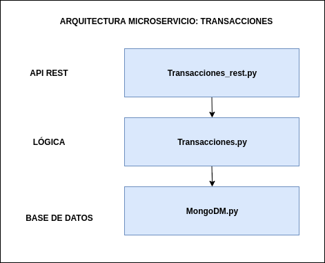

## Almacén de datos

Confirmando lo expuesto en la sección de tecnologías, se ha utilizado **MongoDB** como base de datos para nuestro proyecto, las
razones son las siguientes:

* Realiza muchas operaciones por segundo, siendo mucho más rápida que una base de datos relacional.
* Capaz de almacenar grandes cantidades de datos sin inconveniente.
* Es variable en el sentido de que no fuerza que todos los registros de una colección se guarden con los mismos atributos.

También apuntar que las manipulaciones sobre la base de datos se realizarán concretamente con la librería *pymongo*, que cuenta con una serie de funciones que realizan las operaciones básicas (aunque también más avanzadas) que cualquier tipo de base de datos tiene como búsqueda, inserción, eliminación o actualización de elementos.

Se ha utilizado MongoDB de dos formas diferentes:

* De forma **local**

* De forma **Remoto**

*Destacar que hay una base de datos por microservicio.*

### De forma local

Para poder utilizar MongoDB en local, es decir, desde tu máquina, es necesario instalar mongo, en nuestro caso, se ha instalado la versión *3.6.8*. Para eso se ha introducido en terminal el siguiente comando:

```

sudo apt-get install mongo==3.6.8

```


De este modo ya se pueden utilizar bases de datos de mongoDB de forma local, si introducimos el siguiente comando en terminal:

```

mongo

```

Se puede ver en la siguiente captura de pantalla:

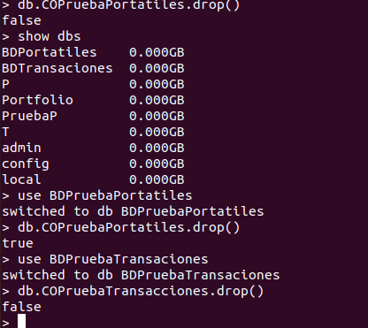

Se acede a la administración de la base de datos a través de la misma terminal donde podremos ver las bases de datos disponibles, sus colecciones internas (lo que en una base de datos SQL serían tablas), insertar, modificar o eliminar datos, entre otras funcionalidades.

### En remoto

Para utilizar MongoBD de forma remota, se valoraron varias opciones, para finalmente acabar quedándonos con **MongoAtlas**, por los siguientes motivos:

* Tiene opciones gratuitas.
* Cuenta con automatización, de tal forma que el usuario puede programar actividades sobre la base de datos MongoDB en la nube.
* Tiene un buen rendimiento.

Una vez seleccionada esta tecnología, nos dirigimos al dominio web de MongoAtlas, el cual es el siguiente: [dominio](https://www.mongodb.com/cloud/atlas).

El primer paso a realizar en esta web es registrarnos (se puede realizar de forma muy rápida usando la cuenta de *gmail*). Seguidamente tendremos que seleccionar un plan, se escogerá el plan gratuito:

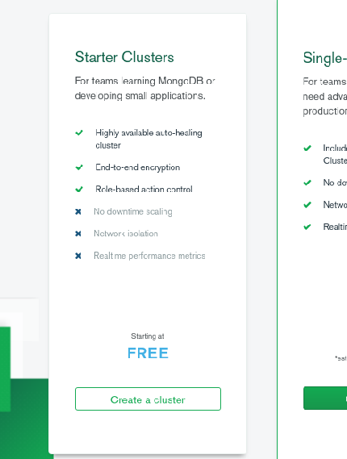

Posteriormente debemos de crear un cluster, para ello seleccionamos como base uno de los gratuitos proporcionados por el dominio web. En la siguiente captura de pantalla se puede ver que se ha seleccionado *Cloud* y la región *belga* que son totalmente gratuitas:

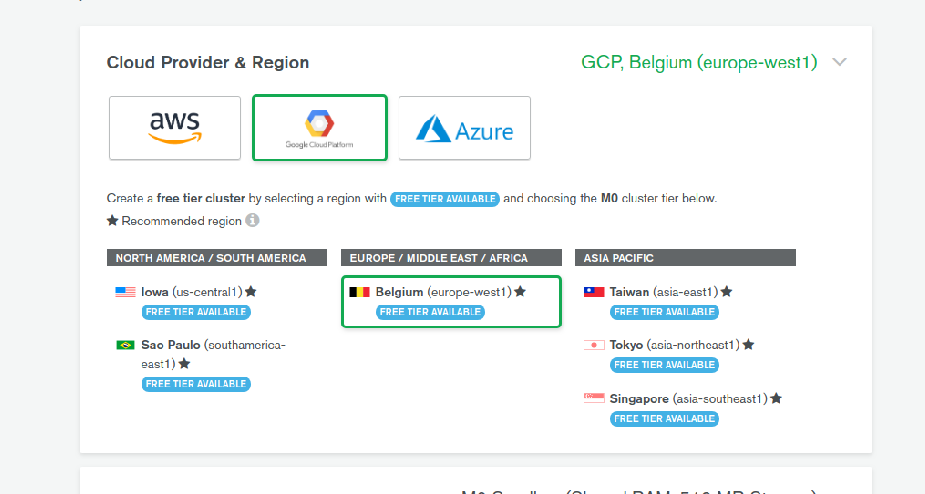

Posteriormente el usuario selecciona la opción de *Crear base de datos*, para allí crear la base de datos tan solo introduciendo el nombre de la misma, así como el nombre de la colección (es lo que sería una tabla en una base de datos SQL), se puede ver en la siguiente imagen:

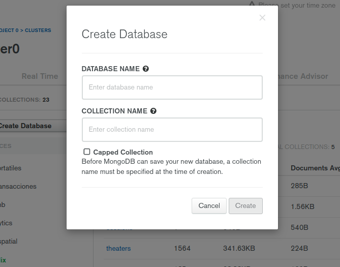

Por ultimo se ha conseguido ver como se conecta la base de datos con cualquier aplicación para utilizarla, es a través de una ruta proporcionada que sustituirá a nuestro *URI*, es decir, a nuestra ruta base. En la siguiente captura de pantalla se puede observar:

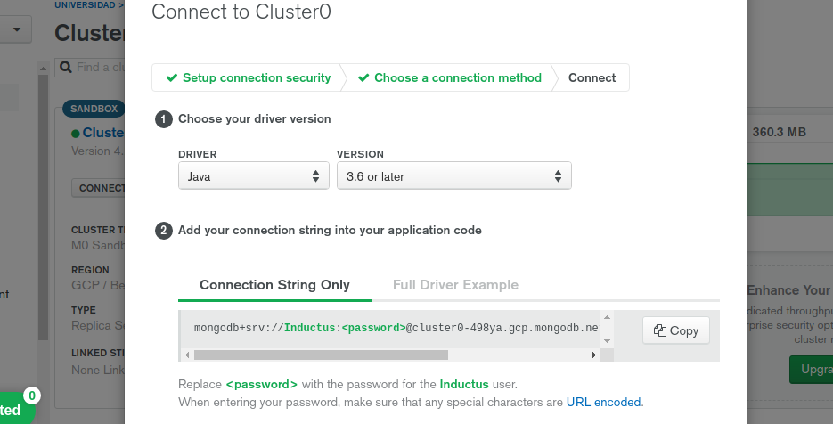

*Destacar que en nuestro proyecto para cambiar entre usar MongoDB en local o en remoto es suficiente con modificar las variables de entorno, para más información acerca de estas, clicar [aqui](docs/variables_de_entorno.md)*.

## Data Manager: MongoDM.py

Para la incrustación de la base de datos de MongoDB a los microservicios implementados se ha utilizado como anteriormente he mencionado la librería **pymongo**.

Utilizando la librería anteriormente comentada se ha creado el fichero [MongoDM.py](https://github.com/NSInductus/CC_Proyecto/blob/master/src/MongoDM.py), el cual es mi *data manager* (o *controlador de datos*), el cual implementa una serie de funciones definidas por mi que utilizan las funciones proporcionadas por pytest, estas funciones son:

* **obtener_elemento:** se encarga de introducir un elemento en la colección de la base de datos.
* **obtener_conjunto_elementos:** se encarga de obtener un conjunto de elementos de la colección de la base de datos que cumplan una determinada característica.
* **obtener_todos_elementos:** se encarga de obtener todos los elementos existentes en la colección de la base de datos.
* **insertar_elemento:** se encarga de insertar un elemento en la colección de la base de datos.
* **actualizar_elemento:** se encarga de actualizar un elemento que ya exista en la colección de la base de datos.
* **borrar_elemento:** se encarga de borrar un elemento existente en la colección de nuestra base de datos.
* **numero_elementos:** se encarga de proporcionar el numero de elementos existentes en la colección de la base de datos.
* **borrar_conjunto:** se encarga de borrar todos los elementos existentes en la colección de la base de datos.

Para utilizar este Data Manager se recurrirá a la técnica de la inyección de dependencias.

### Inyección de dependencias

Como se ha comentado anteriormente se ha utilizado la técnica de la *inyección de dependencias* para conseguir que los microservicios de nuestro proyecto utilicen de forma abstracta la base de datos, para ello se ha creado la clase [MongoDM.py](https://github.com/NSInductus/CC_Proyecto/blob/master/src/MongoDM.py).

Para la inyección de esta clase, se importará en los ficheros que implementan la lógica de negocio de cada uno de los microservicos, es decir, [Portatiles.py](https://github.com/NSInductus/CC_Proyecto/blob/master/src/Portatiles.py) y [Transacciones.py](https://github.com/NSInductus/CC_Proyecto/blob/master/src/Transacciones.py), para posteriormente crear un objeto de la clase [MongoDM.py](https://github.com/NSInductus/CC_Proyecto/blob/master/src/MongoDM.py). Los campos existentes en el constructor de la clase son:

* **uri:** Este parámetro contiene la dirección base, de la base de datos, en el caso de que se este lanzando en local tendremos que poner: *localhost:5000*. Como se ha podido ver: el formato de esta dirección base es el siguiente: *host:puerto*
* **basedatos:** Este parámetro contiene el nombre de la base de datos con la que se trabajará.
* **coleccion:** Esta parámetro contiene el nombre de la colección con la que se trabajará.

*Para la introducción de estos parámetros se utilizarán variables de entorno, para más información acerca de éstas, clicar [aqui](docs/variables_de_entorno.md).*

El *objetivo o fin* de este proceso es que la lógica de negocio de un microservicio y la base de datos sean totalmente independientes, de tal forma que si en el futuro se desea cambiar de base de datos tan solo sea necesario cambiar el *Data Manager*.

De tal forma que la *API REST* realizará llamadas a las funciones de la lógica de negocio del microservicio y esta utilizará el *Data Manager* para gestionar los datos. Cumpliendo con la arquitectura por capas, la cual es la arquitectura que poseen todos mis microservicios implementados.

### Modificaciones en otros ficheros

Se han tenido que realizar una serie de modificaciones sobre algunos ficheros para adaptarlos a la incorporación del *Data Manager*, es decir, del fichero [MongoDM.py](https://github.com/NSInductus/CC_Proyecto/blob/master/src/MongoDM.py).

1. En primer lugar, se han tenido que modificar los ficheros correspondientes al primer microservicio que se había implementado anteriormente, es decir, el microservicio de Portatiles. Porque éste trabajaba con una lista interna, que se ha sustituido por un data_manager, por eso al constructor de esta clase se le introduce un objeto que actuará como data_manager, en este caso, un objeto de tipo MongoDM.
Destacar que hay que cambiar tanto los ficheros de código propiamente dicho, es decir, [Portatiles.py](https://github.com/NSInductus/CC_Proyecto/blob/master/src/Portatiles.py) y [Portatiles_rest.py](https://github.com/NSInductus/CC_Proyecto/blob/master/src/Portatiles_rest.py), como los ficheros de test (aunque los cambios sean más insignificativos comparados con los de los ficheros anteriores), es decir, [test_Portatiles.py](https://github.com/NSInductus/CC_Proyecto/blob/master/test/test_Portatiles.py) y [test_Portatiles_rest.py](https://github.com/NSInductus/CC_Proyecto/blob/master/test/test_Portatiles_rest.py).

2. En segundo lugar, los sistemas de integración continua se ha tenido que realizar los siguientes cambios:

  * *En TravisCi:* Se ha añadido las variables de entorno y se ha agregado de servicio, el servicio de mongoDB.

  * *En CircleCi:* Se ha agregago las variables de entorno y se ha agregado una imagen de docker (correspondiente a MongoDB).

3. En tercer lugar, se ha creado un Dockerfile nuevo, así como se ha creado una nueva regla de construcción automática, se puede ver con más detalle [aquí](docs/docker.md).

*Destacar que en el nuevo microservicio implementado, ya se tiene en cuenta que se utilice el Data Manager desde el primer momento.*

## Estudio de prestaciones

Prestaciones: performance_test.yml

Las prestaciones se han evaluado usando **Taurus**. Se han realizado sobre varios escenarios:

1. Prueba de prestaciones **sobre el microservicio Portatiles**.
2. Prueba de prestaciones **sobre el microservicio Transaciones**.

Estos diferentes escenarios se han probado con dos tipos de bases de datos:

* Una base de datos mongoDB de forma local.
* Una base de datos mongoDB de forma remota, concretamente utilizando MongoAtlas.

Estos diferentes escenarios se han probado levantando el servicio de formas diferentes:

* De forma local, utilizando *gunicorn* con 1 worker.
* De forma local, utilizando *gunicorn* con 2 worker.
* De forma local, utilizando *gunicorn* con 8 worker.
* Levantando un Contenedor(*Docker*).

Mezclando las diferentes posibilidades conseguimos realizar 8 pruebas de prestaciones por microservicio.

Las pruebas de prestaciones debían de superar o igualar *1000 peticiones por segundo* utilizando 10 usuarios concurrentes sin tener ningún error durante el proceso.

El código del fichero donde se definen las pruebas se comentará a continuación:

```
# EVALUACION DE PRESTACIONES CON TAURUS
execution:
    - concurrency: 10   
      ramp-up: 10s      
      hold-for: 50s     
      scenario: portatiles-test  

```
En primer lugar se definen:
* **concurrency:** número de usuarios que participarán de forma simultánea.
* **ramp-up:** tiempo en segundos que tardará en llegar a los usuarios definidos anteriormente .
* **hold-for:** tiempo que se mantienen los usuarios.
* **scenario:** escenario a ejecutar en el test entre los posibles.

```
#Posibles escenarios
scenarios:
    #Escenario microservicio PORTATILES
    portatiles-test:
      requests:
      #Prueba basica: REST DE TRANSACIONES
      - url: http://localhost:8080/portatiles/
        method: GET
      #Numero de portatiles en la BD
      - url: http://localhost:8080/portatiles/numeroPortatilesEnBD
        method: GET
      #Seleccionar un portatil en concreto
      - url: http://localhost:8080/portatiles/seleccionarPortatil/5e2cfeefd46dbb220a0d96
        method: GET
      #Ver portatiles que vende un usuario
      - url: http://localhost:8080/portatiles/verPortatilesEnVentaDeUsuario/358D
        method: GET
```

**El primer escenario: (portatiles-test)**, tiene las siguientes peticiones:

* Una petición *GET* que simplemente es la petición de bienvenida de este microservicio.
* Una petición *GET* para comprobar el numero de portatiles que existen en la base de datos.
* Una petición *GET* que selecciona un determinado portatil de la base de datos con un identificador en concreto.
* Una petición *GET* para encontrar los diferentes portátiles que tiene en venta un usuario, buscando por el DNI del usuario.

```
    #Escenario microservicio TRANSACCIONES
    transacciones-test:
        requests:
        #Prueba basica: REST DE TRANSACIONES
        - url: http://localhost:8000/transacciones/
          method: GET
        #Algun portatil en la base de datos con ese usuario introducido
        - url: http://localhost:8000/transacciones/verEstadisticas/339X
          method: GET
          
```
**El segundo escenario: transacciones-test**, tiene las siguientes peticiones:

* Una petición *GET* que simplemente es la petición de bienvenida de este microservicio
* Una petición *GET* que recoge todas las estadisticas de un usuario, es decir, todas sus transacciones, para ello las cogerá todas y se quedará con las del usuario.

Una vez creado este fichero para ejecutarlo hay que poner en terminal el siguiente comando:

```
$ bzt performance_test.yml -report
```

### Resultados de prestaciones

Para comenzar se levantó el servicio en local utilizando *gunicorn* con 1 solo worker, los resultados se pueden ver a continuación:

* Primer escenario, utilizando 1 Worker y MongoDB de forma local:

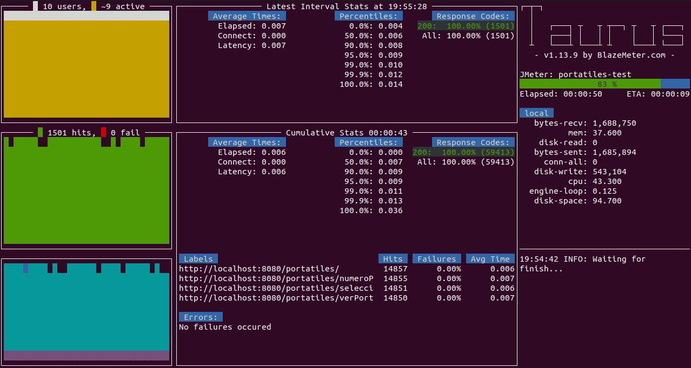


En esta prueba se consiguen **1387.9 peticiones por segundo**, teniendo un tiempo de respuesta medio de 6ms.

* Segundo escenario, utilizando 1 Worker y MongoDB de forma local:

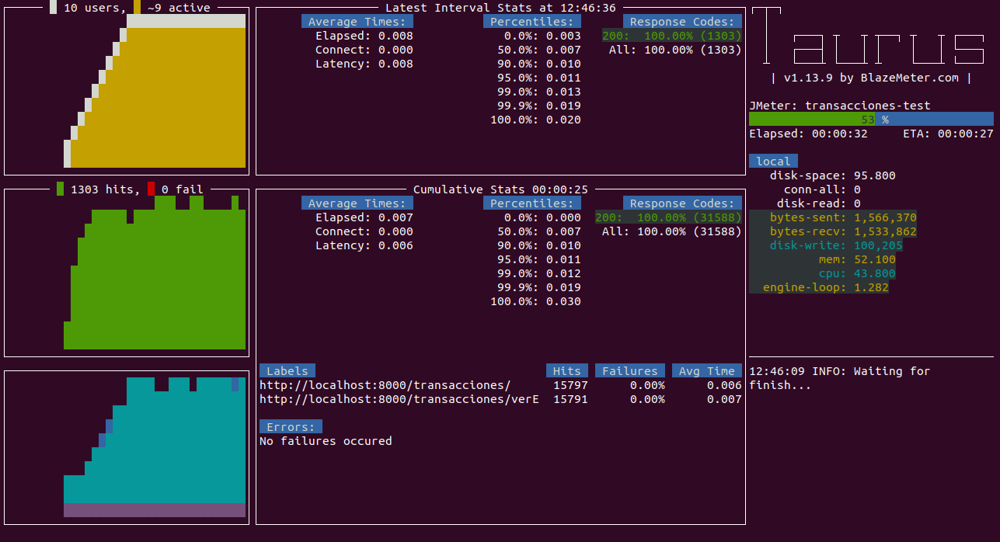
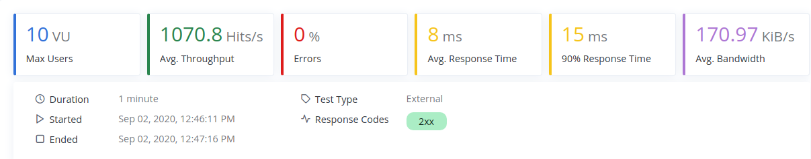

En esta prueba se consiguen **1570.8 peticiones por segundo**, teniendo un tiempo de respuesta medio de 8ms.

* Primer escenario, utilizando 1 Worker y una BD remota (MongoAtlas):

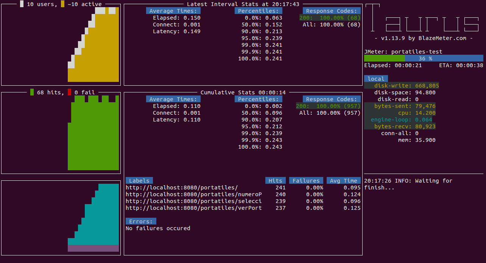


En esta prueba se consiguen **66.24 peticiones por segundo**, teniendo un tiempo de respuesta medio de 141ms. Por lo que en estas condiciones no se supera el mínimo de peticiones (1000).

* Segundo escenario, utilizando 1 Worker y una BD remota (MongoAtlas):

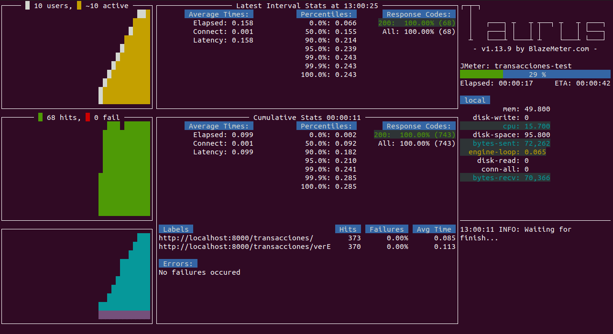
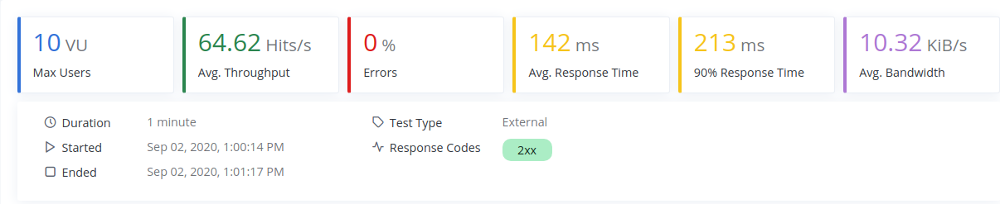

En esta prueba se consiguen **64.62 peticiones por segundo**, teniendo un tiempo de respuesta medio de 142ms. Por lo que en estas condiciones no se supera el mínimo de peticiones (1000).

A continuación se subió el número de workers a 2, los resultados se pueden ver a continuación:

* Primer escenario, utilizando 2 Worker y MongoDB de forma local:

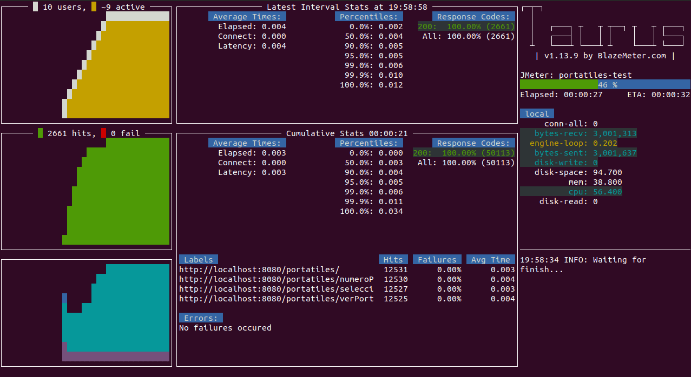
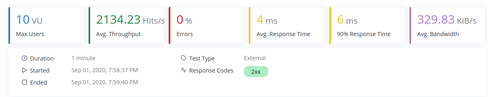

En esta prueba se consiguen **2134.23 peticiones por segundo**, teniendo un tiempo de respuesta medio de 4ms.

* Segundo escenario, utilizando 2 Worker y MongoDB de forma local:

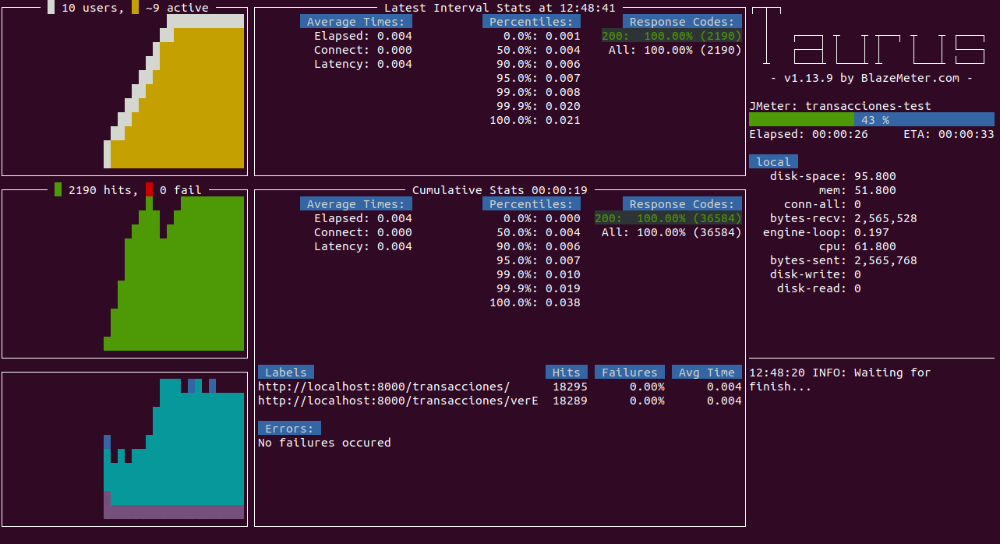


En esta prueba se consiguen **1661.38 peticiones por segundo**, teniendo un tiempo de respuesta medio de 5ms.

* Primer escenario, utilizando 2 Worker y una BD remota (MongoAtlas):

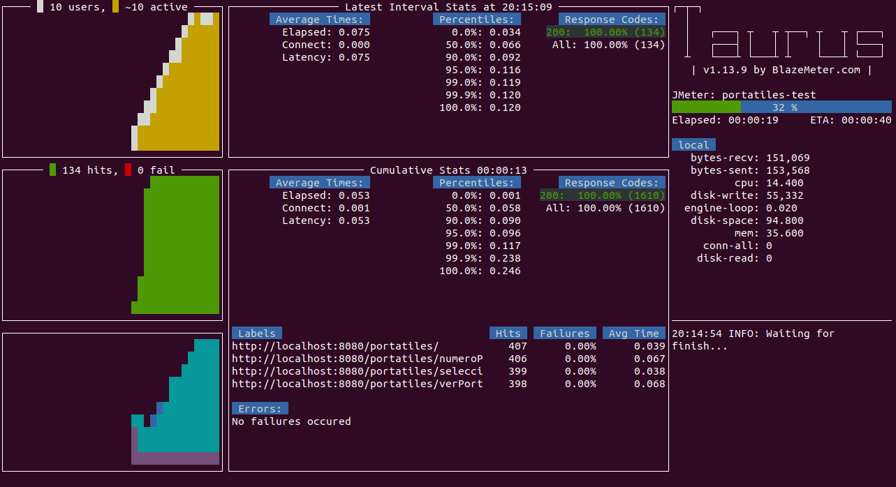
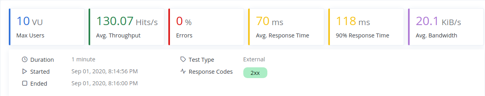

En esta prueba se consiguen **130.07 peticiones por segundo**, teniendo un tiempo de respuesta medio de 70ms.

* Segundo escenario, utilizando 2 Worker y una BD remota (MongoAtlas):

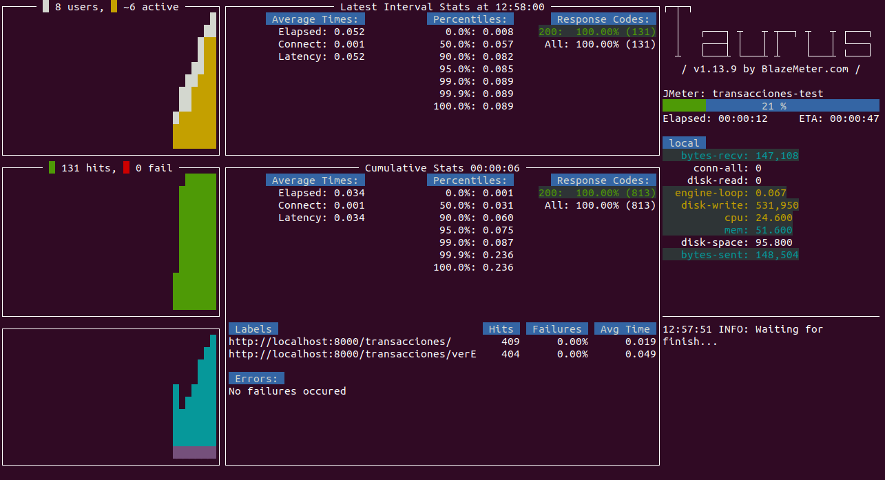


En esta prueba se consiguen **131.42 peticiones por segundo**, teniendo un tiempo de respuesta medio de 71ms. Por lo que en estas condiciones no se supera el mínimo de peticiones (1000).

A continuación se subió el número de workers a 8 (cercano al número máximo de workers que puede soportar mi ordenador), los resultados se pueden ver a continuación:

* Primer escenario, utilizando 8 Worker y MongoDB de forma local:

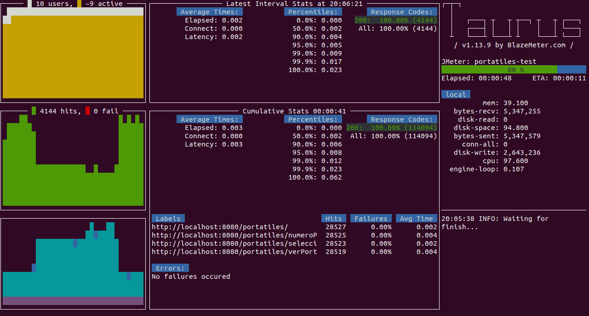


En esta prueba se consiguen **2763.8 peticiones por segundo**, teniendo un tiempo de respuesta medio de 3ms.

* Segundo escenario, utilizando 8 Worker y MongoDB de forma local:

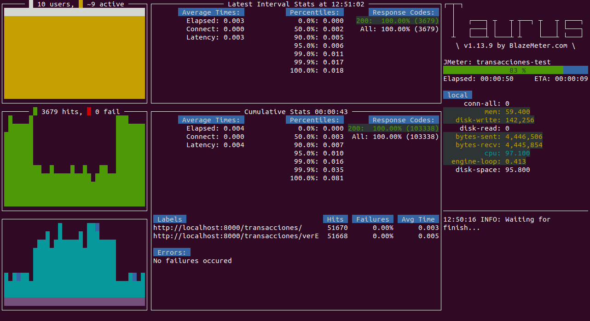


En esta prueba se consiguen **2399.85 peticiones por segundo**, teniendo un tiempo de respuesta medio de 3ms.

* Primer escenario, utilizando 8 Worker y una BD remota (MongoAtlas):

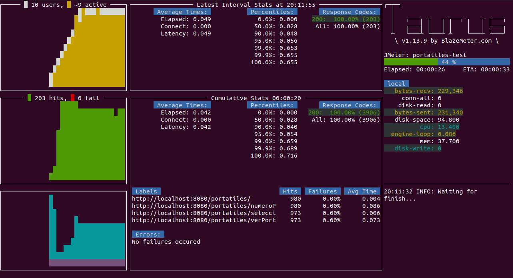
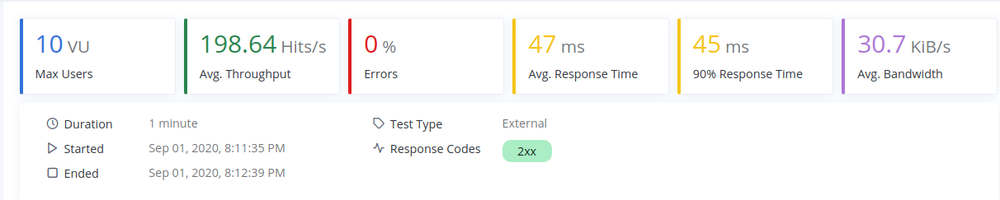

En esta prueba se consiguen **198.64 peticiones por segundo**, teniendo un tiempo de respuesta medio de 47ms. Por lo que en estas condiciones no se supera el mínimo de peticiones (1000).

* Segundo escenario, utilizando 8 Worker y una BD remota (MongoAtlas):

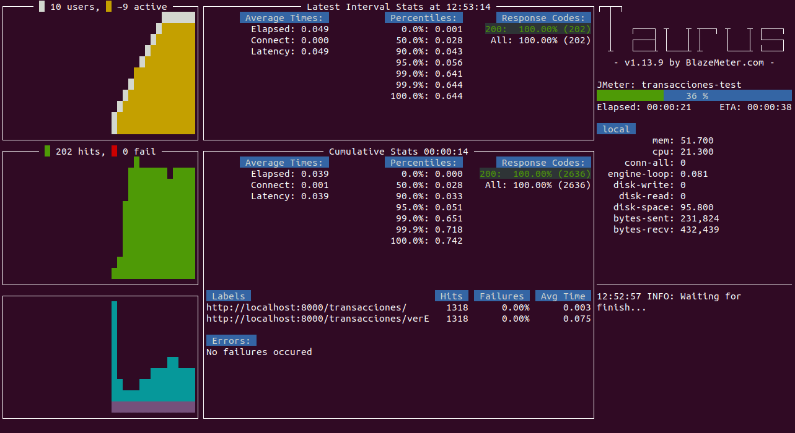
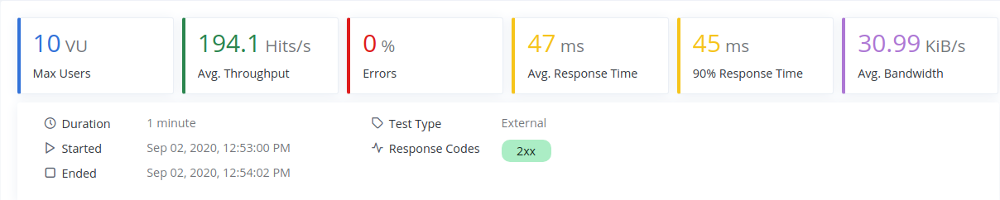

En esta prueba se consiguen **194.1 peticiones por segundo**, teniendo un tiempo de respuesta medio de 47ms. Por lo que en estas condiciones no se supera el mínimo de peticiones (1000).

Por último se realizaron las pruebas utilizando un Docker local para levantar el microservicio, los resultados se pueden ver a continuación:

* Primer escenario, utilizando un Docker y MongoDB de forma local:

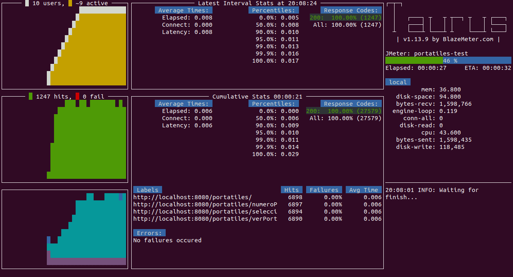
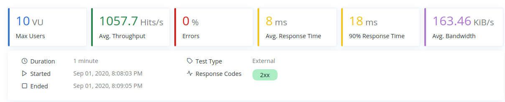

En esta prueba se consiguen **1057.7 peticiones por segundo**, teniendo un tiempo de respuesta medio de 8ms. 

* Segundo escenario, utilizando un Docker y MongoDB de forma local:

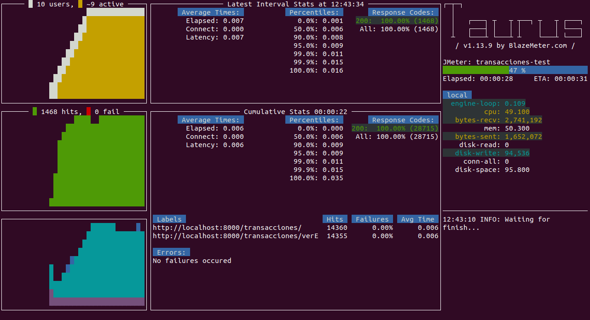


En esta prueba se consiguen **1309.88 peticiones por segundo**, teniendo un tiempo de respuesta medio de 6ms.

* Primer escenario, utilizando un Docker y una BD remota (MongoAtlas):

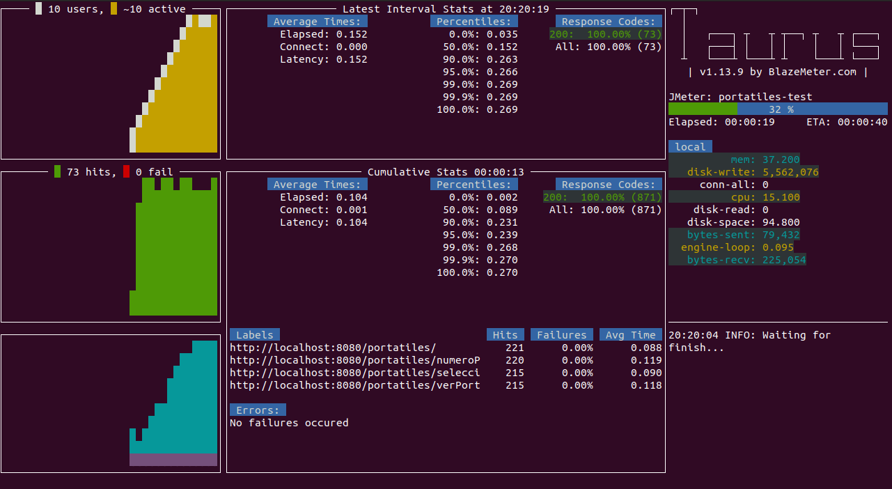


En esta prueba se consiguen **65.17 peticiones por segundo**, teniendo un tiempo de respuesta medio de 141ms. Por lo que en estas condiciones no se supera el mínimo de peticiones (1000).

* Segundo escenario, utilizando un Docker y una BD remota (MongoAtlas):

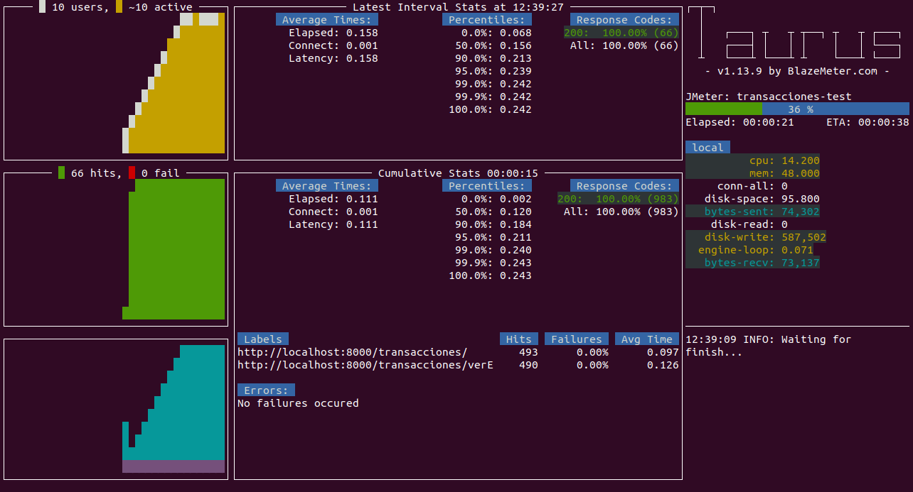
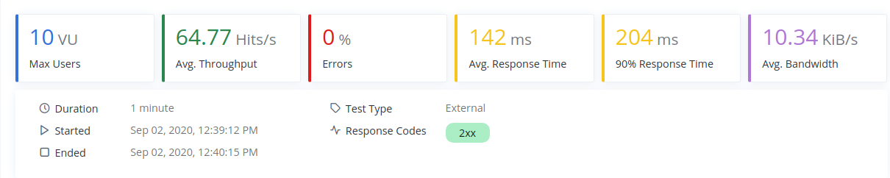

En esta prueba se consiguen **64.77 peticiones por segundo**, teniendo un tiempo de respuesta medio de 142ms. Por lo que en estas condiciones no se supera el mínimo de peticiones (1000).

#### Resumen de resultados

El resumen de todas de las pruebas realizadas sobre ambos escenarios se muestran a continuación:

| Servicio | BD | Escenario | Avg. Throughput | Avg. Response Time |
|--------|--------|---------|---------|---------|
| Gunicorn 1 Worker | BD Local | 1 | 1059.7 | 6 |
| Gunicorn 1 Worker | BD Local | 2 | 1570.8 | 8 |
| Gunicorn 1 Worker | BD Remota | 1 | 65.17 | 141 |
| Gunicorn 1 Worker | BD Remota | 2 | 64.62| 142 |
| Gunicorn 2 Workers | BD Local | 1 | 1307.9 | 4 |
| Gunicorn 2 Workers | BD Local | 2 | 1661.38 | 5 |
| Gunicorn 2 Workers | BD Remota | 1 | 66.24 | 70 |
| Gunicorn 2 Workers | BD Remota | 2 | 131.42 | 71 |
| Gunicorn 8 Workers | BD Local | 1 | 2139.23 | 3 |
| Gunicorn 8 Workers | BD Local | 2 | 2399.85 | 3 |
| Gunicorn 8 Workers | BD Remota | 1 | 130.07 | 47 |
| Gunicorn 8 Workers | BD Remota | 2 | 194.1 | 47 |
| Docker | BD Local | 1 | 2763.8 | 8 |
| Docker | BD Local | 2 | 1309.88 | 6 |
| Docker | BD Remota | 1 | 198.64 | 141 |
| Docker | BD Remota | 2 | 64.77 | 142 |

#### Conclusiones de los resultados

Las conclusiones obtenidas de la ejecución de estas pruebas son:

* **Ambos microservicios (Portatiles & Transacciones)** han superado todas las prueba utilizando una base de datos local, puesto que se ha conseguido que superen las 1000 peticiones por segundo, en algunos casos las han multiplicado. En las pruebas que se utiliza una base de datos remota se nota mucho la diferencia en las peticiones, debido a la latencia que se produce al conectar con la base de datos remota.
* Como más peticiones se consiguen es levantando el servicio con 8 Workers utilizando guricorn o levantando un Docker local.
* Conforme más Workers utiliza guricorn mejores resultados se consiguen.

También documento, que se comenzó ejecutando las pruebas sobre una máquina virtual instalada en mi ordenador portátil, los resultados de lanzar la prueba del primer escenario (1 Worker con MongoDB local) en la máquina virtual, fueron los siguientes:

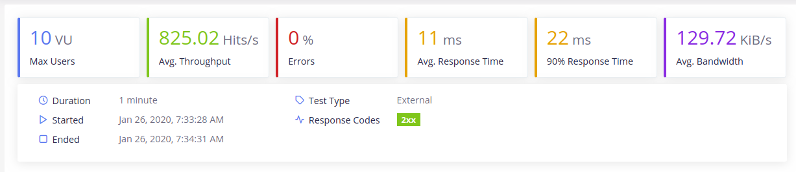

Por lo tanto se decidió cambiar la máquina virtual por mi ordenador de sobremesa que tiene instalado Ubuntu 19, y los resultados comenzaron a ser satisfactorios (resultados expuestos anteriormente).

Por lo que se concluye que la máquina donde se realiza el test de prestaciones también es importante y realizarlas en una máquina virtual no es una buena idea.

## Despliegue y provisionamiento

Para terminar con el proyecto se ha realizado el despliegue y provisionamiento de los dos mircroservicios: *Portatiles y Transacciones*. 

* Estos microservicios han sido desplegados en máquinas virtuales, tanto de forma local como de forma remota, para ambos casos se utiliza *Vagrant* (herramienta que permite crear entornos de desarrollo reproducibles y compartibles). Se ha seleccionado esta herramienta por los siguientes motivos:
  * Es una herramienta gratuita.
  * Es una herramienta muy fácil de usar, permite crear y configurar máquinas virtuales a partir de simples ficheros de configuración.

* Para el provisionamiento se ha utilizado *Ansible*. Se ha seleccionado esta herramienta por los siguientes motivos:
  * Su instalación es muy sencilla.
  * Tiene gran compatibilidad con elementos de la infraestructura.
  Soporta la mayoría de distribuciones.

* Para crear la máquina virtual de forma remota se ha utilizado el servicio de computación en la nube creado por Microsoft: *Azure*. Los motivos por los que se ha seleccionado *Azure* en lugar de otros como *Google Cloud* son los siguientes:
  * Se puede recurrir a una prueba gratuita de 30 días.
  * Tiene una alta disponibilidad por lo que asegura la continuidad del servicio y disponibilidad de tus datos.
  * Tiene una altas medidas de seguridad.

### Despliegue y provisionamiento: Local

Además de lo comentado anteriormente, destacar que se utilizará *Virtualbox* como herramienta de virtualización, la razón principal es que es una herramienta totalmente gratuita.

En primer lugar, se ha instalado *Virtualbox* a través del siguiente comando:

```
$ sudo apt install virtualbox
```
En segundo lugar, se ha instalado *Vagrant* a través de los siguientes comandos:

```
$ curl -O https://releases.hashicorp.com/vagrant/2.2.6/vagrant_2.2.6_x86_64.deb
$ sudo apt-get update
$ sudo apt install ./vagrant_2.2.6_x86_64.deb

```
En tercer lugar, se ha instalado *Ansible* a través de los siguientes comandos:

```
$ sudo apt-add-repository ppa:ansible/ansible
$ sudo apt-get install ansible

```
También utilizando el plugin de ansible-galaxy, se han instalado roles creados por la comunidad (con los roles podemos crear una estructura de ficheros y directorio para separar los elementos y así poder reutilizarlos fácilmente), para poder utilizarlos directamente en nuestro fichero que describe configuraciones, despliegue y orquestación en *Ansible* comúnmente llamado playbook, en este caso se han descargado los siguientes roles:
  * enix.mongodb
  * geerlingguy.docker

Para instalar estos roles se utilizan los siguientes comandos:

```
$ ansible-galaxy install enix.mongodb
$ ansible-galaxy install geerlingguy.docker
```
Para levantar la máquina virtual utilizando la herramienta *Vagrant* se creará a priori un archivo de configuración llamado *Vagrantfile*, en él se centraliza toda la configuración de la máquina virtual que se desea levantar. El punto fuerte de *Vagrant* es que se puede crear exactamente la misma máquina virtual todas las veces que se desee utilizando el *Vagrantfile*.

El archivo [*Vagrantfile*](https://github.com/NSInductus/CC_Proyecto/blob/master/Vagrantfile) creado para el proyecto se puede ver totalmente documentado [aquí](docs/vagrantfile.md)). En resumen es el archivo que se encarga de configurar la creación de una máquina virtual de 2048 de memoria y 2 cpus que utiliza como imagen base Ubuntu/bionic64 (*justificación de la elección de estas características e imagen base más adelante*), que se provisiona utilizando un playbook de *Ansible*, en mi caso es el fichero [workstate.yml](https://github.com/NSInductus/CC_Proyecto/blob/master/provision/workstate.yml).
		
El fichero [workstate.yml](https://github.com/NSInductus/CC_Proyecto/blob/master/provision/workstate.yml) se puede ver totalmente documentado [aquí](docs/workstate.md)). En resumen configura las tareas necesarias para descargar de DockerHub las imágenes de los dos microservicios de este proyecto y arrancar estos microservicios.

Para el correcto funcionamiento de *Ansible* también es necesario la creación de los siguientes ficheros:
  * [ansible.cfg](): Fichero de configuración general de *Ansible*. 
  * [ansible_hosts](): Fichero que define el inventario utilizado por *Ansible*.

Destacar que como las imágenes descargadas hacían uso de variables de entorno, estas serán inyectadas en [workstate.yml](https://github.com/NSInductus/CC_Proyecto/blob/master/provision/workstate.yml)  de la siguiente forma: vars_files: *ruta_variables*, en *ruta_variables* debemos de introducir la ruta de un archivo con extensión (*yml*) que tenga el siguiente formato:

```yml
URI_BD_P: localhost:27017
BD_P: BDPruebaPortatiles
CO_P: COPruebaPortatiles
URI_BD_T: localhost:27017
BD_T: BDPruebaTransacciones
CO_T: COPruebaTransacciones
HOST: localhost
PORT: "8080"
PORT_2: "8000"
```
Una vez creados todos los ficheros comentados anteriormente pondremos en la terminal el siguiente comando:

```
$ vagrant up --provision
```
Este comando se encargará de crear la máquina virtual utilizando como herramienta de virtualización *Virtualbox* y de provisionarla utilizando *Ansible*.

Para comprobar que los microservicios están correctamente desplegados podemos hacer una petición utilizando exactamente las mismas rutas que anteriormente (*localhost*), puesto que los puertos de la máquina virtual están conectados a los puertos del ordenador.

También es posible acceder a la máquina virtual a través de *SSH*, esto puede ser útil si hay algún tipo de fallo o se desea comprobar los paquetes que estan instalados en la máquina, las imágenes de docker descargas o los contenedores que están arrancados. Para esto se utiliza el siguiente comando:

```
$ vagrant ssh
```
Otra forma de comprobar que la máquina ha sido correctamente creada es abrir la aplicación de escritorio de *Virtualbox* y comprobar como aparece una nueva máquina, como muestra la siguiente captura de pantalla:

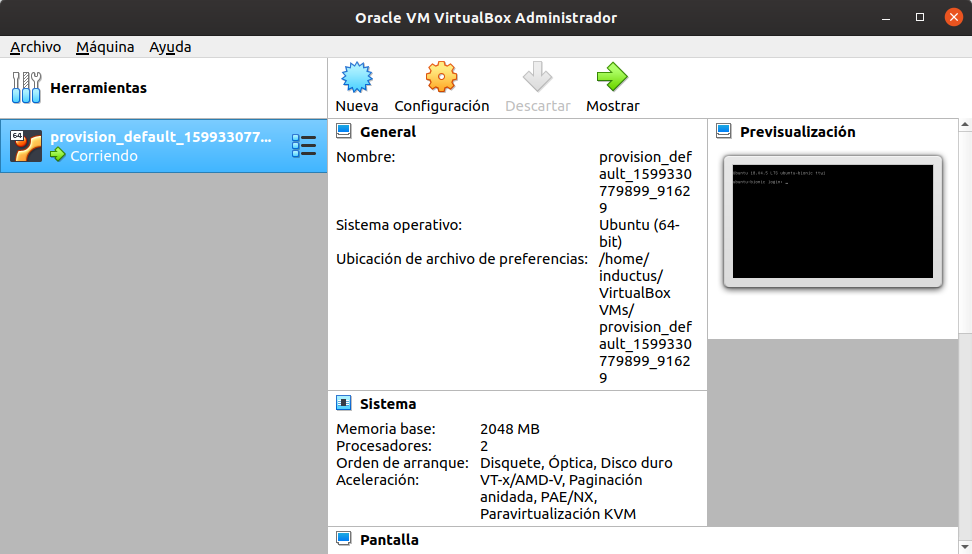

Para parar la máquina virtual en marcha se utiliza el siguiente comando:

```
$ vagrant destroy
```
### Despliegue y provisionamiento: Remoto

Para el despliegue y provisionamiento de forma remota y puesto que se ha utilizado *Azure*, el primer paso será instalarlo (azure) de forma local en nuestra máquina, para eso se utilizarán los siguientes comandos:

```
$ sudo apt-get update
$ sudo apt-get install ca-certificates curl apt-transport-https lsb-release gnupg
$ curl -sL https://packages.microsoft.com/keys/microsoft.asc |
    gpg --dearmor |
    sudo tee /etc/apt/trusted.gpg.d/microsoft.gpg > /dev/null
$ AZ_REPO=$(lsb_release -cs)
echo "deb [arch=amd64] https://packages.microsoft.com/repos/azure-cli/ $AZ_REPO main" |
    sudo tee /etc/apt/sources.list.d/azure-cli.list
$ sudo apt-get update
$ sudo apt-get install azure-cli
```

También es necesario instalar:
  * Un plugin de *Vagrant* para que pueda trabajar con *Azure*.
  ```
  $ vagrant plugin install vagrant-azure
  ```
  * Una box que *Vagrant* pueda utilizar.
  ```
  $ vagrant box add azure https://github.com/azure/vagrant-azure/raw/v2.0/dummy.box --provider azure
  ```

Posteriormente se crea una cuenta en: [azure.microsoft.com](https://azure.microsoft.com/es-es/free/search/?&ef_id=EAIaIQobChMIsdzHwtfV6wIV2evtCh3JHgpUEAAYASAAEgJAoPD_BwE:G:s&OCID=AID2100112_SEM_EAIaIQobChMIsdzHwtfV6wIV2evtCh3JHgpUEAAYASAAEgJAoPD_BwE:G:s&dclid=CPOIsMPX1esCFY3OGwodd6YGyg), en mi caso concreto he aprobechado la versión de 30 días de prueba, para conseguirlo tan solo es necesario introducir una serie de datos personales.

Una vez tengamos nuestra cuenta de *Azure*, tenemos que acceder a la misma desde nuestro ordenador, para eso introducimos en la terminal lo siguiente:

```
$ az login
```
Después es necesario registrar la aplicación en *Azure*, de este modo se conseguirán una serie de claves. Para esto se utiliza el siguiente comando:

```
$ az ad sp create-for-rbac
```

Posteriormente necesitaremos la id de suscripción de *Azure*, para esto usamos:

```
$ $ az account list --query "[?isDefault].id" -o tsv
```

Con estos dos últimos comandos conseguiremos la información necesaria para rellenar las variables de entorno del nuevo *Vagrantfile* que se ha creado para el despliegue y provisionamiento de la aplicación de forma remota.

Las variables de entorno necesarias son:
  * AZURE_TENANT_ID = que corresponde al valor que tiene *tenant*.
  * AZURE_CLIENT_ID = que corresponde al valor que tiene *appId*.
  * AZURE_CLIENT_SECRET = que corresponde al valor que tiene *password*.
  * AZURE_SUBSCRIPTION_ID = que corresponde al valor que proporciona el último comando ejecutado.

El nuevo [*Vagrantfile*](https://github.com/NSInductus/CC_Proyecto/blob/master/Vagrantfile) creado para esta parte se detalla [aquí](docs/vagrantfile.md). En resumen, configura la creación de una máquina virtual en tu cuenta de *Azure* con las caracteristicas indicadas (en este caso se ha utilizado un tamaño de "Standard_B2s" (máquina con 2 cores y 4 GiB de memoria)) utilizando una imagen de UbuntuServer:16.04-LTS, así como configura el aprovisionamiento utilizando el mismo playbook que anteriormente ([workstate.yml](https://github.com/NSInductus/CC_Proyecto/blob/master/provision/workstate.yml)).

Finalmente para lanzar el proceso de despliegue y provisión de la máquina virtual remota se ejecuta el siguiente comando:

```bash
$ vagrant up --provider=azure
```
Para comprobar que la máquina virtual ha sido creada en *Azure* correctamente podemos ir a la página web de *Azure*, entrar en nuestra cuenta, entrar posteriormente en "consola" y finalmente en la sección de "máquinas virtuales", de esta forma se puede comprobar si se han creado nuevas máquinas virtuales, como se puede ver en la siguiente captura de pantalla:

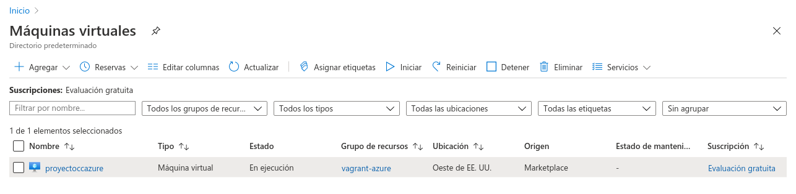

*Destacar que estos pasos se han ido siguiendo desde el propio README del proyecto de github del plugin de *Azure* para *Vagrant* (vagrant-azure), el enlace se puede consultar al final en las referencias.*

Para realizar las peticiones se utiliza la siguiente URL.

URL: http://proyectoccazure.westus.cloudapp.azure.com/

A través de esa URL, utilizando los puertos y rutas adecuadas se pueden realizar todas las peticiones que se deseen.

### Tests de Prestaciones para nuestros servivios desplegados

Todos los tests de prestaciones se han realizado con Taurus. Las pruebas se dividen en dos: pruebas iniciales y pruebas sobre microservicios desplegados.

#### Pruebas iniciales

Las primeras pruebas se realizaron para seleccionar la imagen base, las candidatas eran: *ubuntu/bionic16, centos/7 y debian/jessie64*

Para comprobar cuál era la que mejores resultados ofrecía se recurrió a realizar *Tests de Prestaciones* con Taurus, para poder hacer una comprobación justa todas las pruebas se han realizado sobre el microservio portátiles y con un despliegue y provisionamiento local.

Los resultados han sido resumidos en la siguiente tabla:

| Imagen base | Avg. Throughput | Avg. Response Time |
|--------|--------|---------|
| ubuntu/bionic64 | 465.08 | 19 |  
| centos/7 | 425.13 | 21 |  
| debian/jessie64 | 459.98 | 19 |  

*Por esto se ha seleccionado Ubuntu para ambos despliegues utilizando la imagen base de "ubuntu/bionic64" como imagen base en el despliegue local y "Canonical:UbuntuServer:16.04-LTS:latest" en el despliegue remoto.*

No se realizaron pruebas para probar diferentes tamaños puesto que mi ordenador no soportaba mucho más de lo que se le asigno a la máquina virtual local, y puesto que se deseaban unas comparaciones justas entre el despliegue local y el despliegue remoto, se intentó buscar unas características similares para la máquina virtual remota, por esto se selecciono de tamaño "Standard_B2s".

#### Pruebas sobre microservicios desplegados

Por último, se han realizado *Tests de Prestaciones* a nuestros dos microservicios (*portatiles y transacciones*) sobre los distintos despliegues, es decir, Local y Remoto.

*Destacar que para realizar las pruebas, en el fichero de configuración de las mismas al despliegue remoto se le cambia "localhost" por la URL de nuestro proyecto en Azure. Para esto se han definido dos nuevos escenarios (portatiles-test-azure & transaciones-test-azure) que son iguales que los anteriores escenarios definidos (portatiles-test & transaciones-test), con la unica exepción del cambio comentado anteriormente.*

Podemos esperar que no consigan llegar al número de peticiones al minuto que llegaba antes (cuando se desplegaban los servicios de forma local), es más, ni siquiera podemos esperar que llegue a la mitad y aún menos si pensamos en el despliegue en *Azure". Por lo que 400 peticiones por minuto creo que es el objetivo idoneo a superar en el despliegue en máquinas virtuales locales y 20 en el despliegue en *Azure*.

En primer lugar, se realizarán las pruebas sobre el servicio desplegado en una máquina virtual local.

Para el microservicio de portatiles los resultados son:

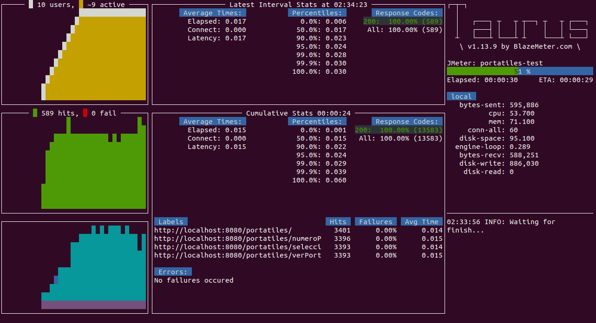
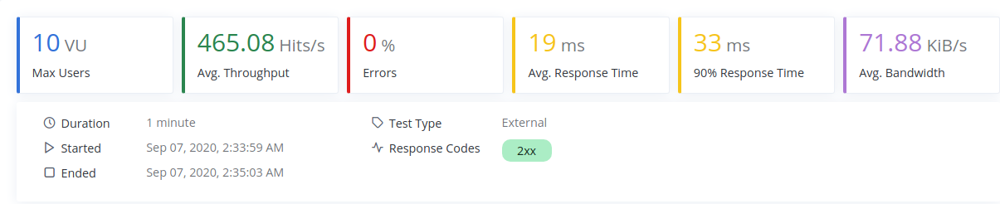

Para el microservicio de transacciones los resultados son:

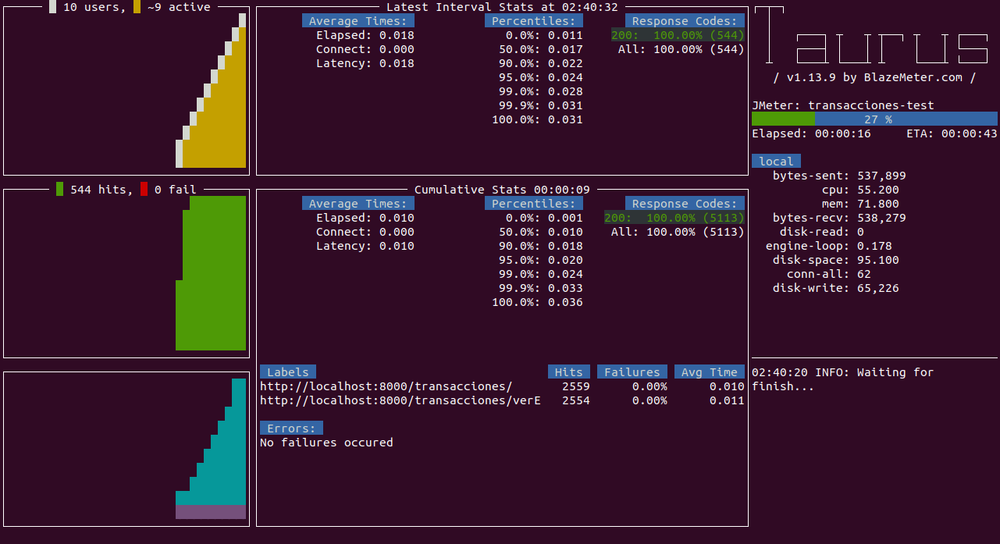


En segundo lugar, se realizarán las pruebas sobre el servicio desplegado en *Azure*o de forma remota.

Para el microservicio de portatiles los resultados son:

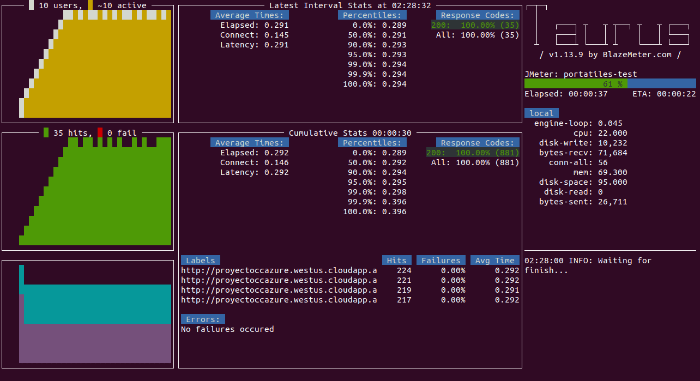


Para el microservicio de transacciones los resultados son:

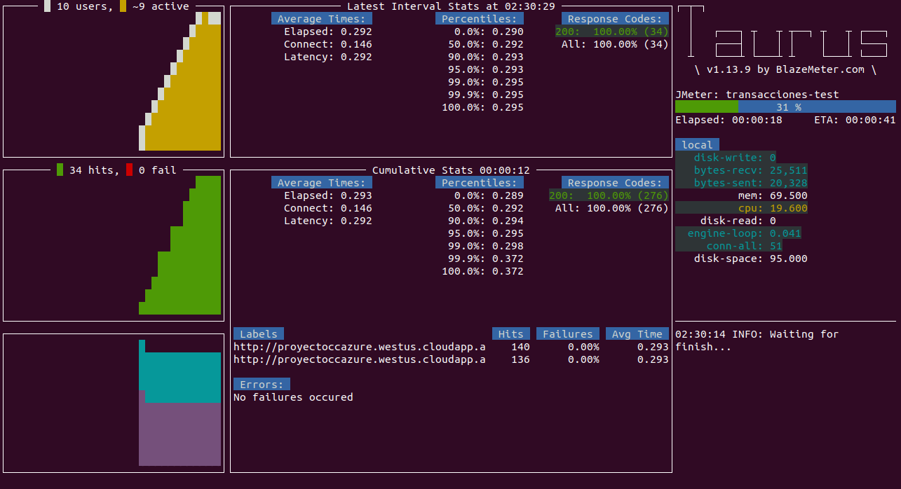
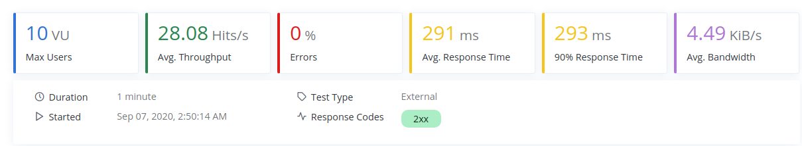

La tabla que resume los resultados mostrados anteriormente es la siguiente:

| Despliegue local/remoto | Microservicio | Avg. Throughput | Avg. Response Time |
|--------|--------|---------|---------|
| Local | portatiles | 465.08 | 19 | 
| Local | transacciones | 419.73 | 21 | 
| Remoto | portatiles | 31.73 | 291 | 
| Remoto | transacciones | 28.08 | 291 | 

Las conclusiones que se puede sacar de estos resultados son las siguientes:
  * Los resultados en términos de velocidad son muy malos, sobretodo si los comparamos con los conseguidos anteriormente cuando lanzabamos los servicios desde nuestro ordenador y se utilizaba una base de datos MongoDB Local, esto es debido a que en estos tests el servicio está siendo desplegado en una máquina virtual utilizando Docker, por lo que la latencia aumenta de manera considerable.
  * Si nos ceñimos a comparar únicamente los resultados de estas 4 pruebas finales se puede decir que el microservicio más rápido según los escenarios que tenemos es el microservicio portatiles.
  * El servicio desplegado en una máquina virtual de forma local es bastante más rápido que el despleguedo de forma remota en *Azure* esto seguramente es debido al retardo lógico al tener el servidor en la nube.
  * Se puede decir que ambos microservicios cumplen con las espectativas (en ambos despliegues) creadas antes de realizar las pruebas.

## Referencias

* https://www.softeng.es/es-es/productos/microsoft-azure/beneficios-de-azure-para-tu-empresa.html
* https://www.conasa.es/blog/vagrant-la-herramienta-para-crear-entornos-de-desarrollo-reproducibles/
* https://www.ochobitshacenunbyte.com/2019/01/30/que-es-ansible-para-que-sirve/
* https://blogvirtualizado.com/includes-y-roles-en-ansible/
* https://github.com/Azure/vagrant-azure
* https://www.returngis.net/2015/11/usa-vagrant-con-microsoft-azure/