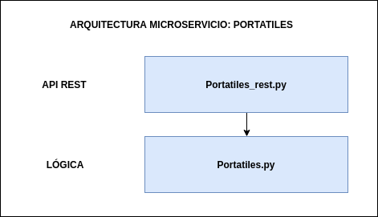

# Proyecto de Cloud Computing

[](https://www.gnu.org/licenses/gpl-3.0)
[](https://travis-ci.com/NSInductus/CC_Proyecto)
[](https://circleci.com/gh/NSInductus/CC_Proyecto)
[](https://codecov.io/gh/NSInductus/CC_Proyecto)
[](https://cc-proyecto.herokuapp.com/)

Proyecto para desarrollar en la asignatura de **Cloud Computing** correspondiente al Máster de Ingeniería Informática.

## Descripción

El proyecto consistirá en un bakc-end para la compra/venta de portátiles. Para una Descripción más detallada del proyecto, ver [aquí](docs/descripcion.md).

## Más información sobre el proyecto

A continuación se muestra en forma de índice el acceso a más información referente al proyecto.

* [Tecnologías utilizadas](docs/tecnologias.md).
* [Historias de usuario](docs/historias_de_usuario.md).
* [Test](docs/test.md).
* [Licencia](docs/licencia-md)

## Arquitectura

La arquitectura será una arquitectura basada en microservicios. Para más información acerca de la arquitectura del proyecto, ver [aquí](docs/arquitectura.md).

### Arquitectura de los Microservicios

Los microservicios implementados o que se implementarán tendrán una arquitectura por capas, la cuál se basa en separar la funcionalidad del microservicio en diferentes capas, con el fin de seguir los principios de: abstracción, encapsulamiento, funcionalidad, alta cohesión, reutilizable y desacople.

#### Arquitectura del microservicio: Portatiles


* **Primera capa:** la primera capa de este microservicio contiene la API REST, es decir, el archivo [Portatiles_rest.py](src/Portatiles_rest.py), este contendrá las rutas que se utilizarán para utilizar el microservicio, es decir, para realizar peticiones


* **Segunda capa:**  la segunda capa de este microservicio se encarga de administrar la lógica del microservicio, esta consiste en el archivo [Portatiles.py](src/Portatiles.py), el cuál está repleto de funciones que son de utilidad para la segunda capa.


* *Pendiente de añadir la última capa que contendrá la base de datos del microservicio y que será utilizada por el mismo.*

La Arquitectura de este servicio se puede comprender fácilmente observando la siguiente imagen:



## Microservicio: Portatiles

Este microservicio presenta las siguientes rutas:

1. **GET-> /** es la ruta de presentación y también sirbe para comprobar que funciona bien el microservicio.
2. **GET-> /numeroPortatilesEnVenta** es para ver cuantos portatiles existen en venta.
3. **GET-> /seleccionarPortatil/int:id_venta>** selecciona para mostrar el portatil en venta cuyo *id_vente* coincida con el introducido en la ruta.
4. **POST-> /agregarPortatil/marca/modelo/DNIvendedor/int:precio/comentario/pantalla/procesador/RAM/almacenamiento/grafica/bateria/SO** es para agregar un portátil al stock de venta, destacar que los 4 primeros argumentos son obligatorios: marca, modelo, DNIvendedor y precio, mientras el resto son opcionales.
5. **PUT-> /modificarPortatil/int:id_venta/int:precio/modelo/marca/comentario/pantalla/procesador/RAM/almacenamiento/grafica/bateria/SO** es para modificar un portátil anteriormente introducido en el stock de venta, destacar que son necesarios los 2 primeros argumentos: id_venta y precio, mientras los demás son opcionales.
6. **DELETE-> /eliminarPortatilPorIdVenta/int:id_venta>** es para eliminar un portátil existente en el stock de venta de portátiles.
7. **GET-> /verPortatilesEnVentaDeUsuario/DNIusuario** es para ver los portátiles que tiene en venta el usuario cuyo *DNI* coincida con el *DNIvendedor* de los portátiles.
8. **GET-> /buscarPortatilPorPrecio/int:limite_inferior/int:limite_superior** es para buscar un portátil por un rango de precios, entre los existentes en el stock de venta de portátiles.
9. **GET-> /buscarPortatilPorModeloMarca/modelo/marca** es para búscar un portátil por su modelo y su marca, entre los existentes en el stock de venta de portátiles.
10. **GET-> /compararPotatiles/modelo/marca** es parecida a la ruta anterior pero consigues una comparación de estos portátiles por precio de venta.
*Destacar que el microservicio manda los datos al cliente en forma de archivo json*

## Herramienta de construcción

Como herramienta de construcción se utilizará **invoke**, por su madurez y fiabilidad frente a otras herramientas , así como por su detallada y clara documentación que permiten al usuario saber como tiene que utilizar invoke en cada momento.

Para poder utilizarla hay que instalarla en python, para eso se escribe en la terminal el siguiente comando:

```shell
$ pip install invoke
```

Para la configuración de la misma, se ha agregado el fichero [tasks.py](https://github.com/NSInductus/CC_Proyecto/blob/master/tasks.py).


```
buildtool: tasks.py
```

Para utilizar la herramienta de construcción se ha de escribir en la terminal "invoke" seguido de la tarea que se desea que realice la herramienta. Estas tareas se han definido anteriormente en el fichero de configuración de la herramienta.

Las posibles tareas que se pueden hacer son:

* **install**: Esta tarea es la encargada de instalar las dependencias necesarias para que funcione nuestro proyecto, las cuales están definidas en el fichero [requirements.txt](https://github.com/NSInductus/CC_Proyecto/blob/master/requirements.txt). Para esto hay que escribir en la terminal:
```
$ invoke install
```

* **test**: Esta tarea es la encargada de ejecutar los test unitarios, sobre nuestras clases de python. Para esto hay que escribir en la terminal:
```
$ invoke test
```

* **coverage**: Esta tarea es la encargada de ejecutar los test de cobertura, sobre nuestras clases de python. Para esto hay que escribir en la terminal:
```
$ invoke coverage
```

* **start**: Esta tarea es la encargada de levantar el microservicio utilizando gunicorn. En esta tarea se pueden utilizar 2 argumentos opcionales para modificar el host y el puerto donde se ejecuta, por defecto el host será *0.0.0.0* y el puerto será *8080*.
```
$ invoke start [-h/--host <host>] [-p/--puerto <puerto>]
```

* **stop**: Esta tarea es la encargada de detener el microservicio lanzado anteriormente con la tarea: *start*.
```
$ invoke stop
```

## Integración continua

Como herramientas para la integración continua se ha utilizado: **TravisCi** & **CircleCI**. Para más información acerca de la integración continua, ver [aquí](docs/integración_continua.md).


## Docker

En primer lugar decir que se ha utilizado DockerHub para la creación de la imagen de mi proyecto utilizando un archivo Dockerfile.

Contenedor: https://hub.docker.com/repository/docker/nsinductus/cc_proyecto

La imagen residente en el contenedor anteriormente linkado se ha construido sobre una imagen base de debian concretamente debian:unstable-slim. Se ha seleccionado esta imagen como base después de un proceso de selección el cuál se puede ver [aquí](docs/comparacion_imagenes.md).

### Dockerfile

Como se ha mencionado anteriormente la imagen se ha construido utilizando el archivo archivo [Dockerfile](Dockerfile).

Este archivo cuenta con varias partes:


```
FROM debian:unstable-slim

LABEL maintainer="Angel Murcia Diaz <angelmd96@correo.ugr.es>"
```

En esas primeras dos líneas,se establece la imagen que se va a utilizar como base y se declara quiene s la persona que mantiene el contenedor.


```
ARG PORT=8080

ENV PORT=${PORT}
```

En las siguientes 2 líneas, se le da un valor por defecto al puerto, en este caso *8080* y se establece el puerto como variable de entorno para el contenedor.

```
WORKDIR /

RUN apt-get update && apt-get install -y python python3-pip

```

En las siguientes líneas se establece el directorio de trabajo y se actualizan los repositorios y se instala tanto python3 como la herramienta pip.

```
COPY requirements.txt /tmp/

RUN pip3 install --no-cache-dir -r ./tmp/requirements.txt

```

A continuación, se copia el archivo de los requerimientos en la carpeta tmp y se instalan esos requerimientos con la herramienta pip.


```
COPY src /src/

EXPOSE ${PORT}

```

Después se copia los archivos necesarios a la carpeta src y se muestra el puerto donde escucha el servidor.


```
WORKDIR /src/

CMD gunicorn -b 0.0.0.0:${PORT} Portatiles_rest:app

```

Finalmente se establece el directorio de trabajo en la carpeta src y se lanza el servidor utilizando gurnicorn.


### Proceso seguido para la creación de la imagen

En primer lugar me he dado de alta en DockerHub y he linkado mi cuenta de GitHub con mi nueva cuenta de DockerHub. También he instalado la herramienta docker por terminal.

En segundo lugar he creado un repositorio en DockerHub y he linkado mi repositorio con el de Github., como se ve en la siguiente imagen:

ima

Después he probado en local ha construir mi microservicio sobre varias imágenes base, para eso he ido modificando el [Dockerfile](Dockerfile) y utilizando el siguiente comando para crear la imagen:

```
& docker build -t nombre_imagen ruta
```

Para posteriormente arrancar el contenedor en local utilizando esa imagen, con el comando:

```
& docker run ID_nombre_imagen
```
Y después seguir el proceso explicado en la sección: [Comparación de imágenes base](docs/comparacion_imagenes.md).

Posteriormente se creado el archivo [Dockerfile](Dockerfile) definitivo, rellenado como se ha explicado en la sección anterior  y he realizado un *push* a la rama master de mi proyecto de GitHub.


Después de realizar el *push* DockerHub automaticamente localiza el Dockerfile en mi repositorio de GitHub y lo utiliza para crear la imagen, la cual se quedará disponible en la web por si alguien la quiere descargar y utilizar, para realizar este proceso simplemente abria que utilizar los siguientes 2 comandos:


```
$ docker pull nsinductus/cc_proyecto:latest

```

Este primer comando para descargar la imagen de mi microservicio a local.


```
$ docker run ID_de_la_imagen_descargada

```

Este segundo comando para arrancar el contenedor en local.
