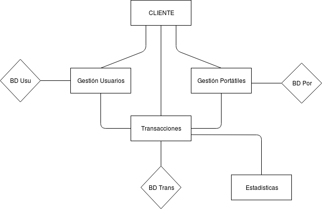

# Proyecto de Cloud Computing

Proyecto para desarrollar en la asignatura de Cloud Computing correspondiente al Máster Profesionalizante de Ingeniería Informática.

## Descripción del problema

Hoy día todos sabemos de la importancia de los ordenadores y de internet, prácticamente toda familia tiene más de un ordenador en casa.
En los últimos años, los ordenadores portátiles han ganado mucho terreno a los ordenadores de sobremesa, por poder tener un ordenador con las mismas características que un ordenador de sobremesa sumado a su gran comodidad a la hora de ser trasportado.
Los estudiantes de universidad necesitan el ordenador sea cuál sea la carrera que estén estudiando aunque solo lo necesiten para descargar apuntes y escribir en archivos de texto. Los ordenadores portátiles nuevos con unas características decentes para que les puedan servir fuera de la universidad para algo más que para descargar apuntes no suelen ser baratos, si a esto le sumamos que normalmente los estudiantes tienen problemas de dinero, estos pueden llegar a tener dificultades para conseguir un ordenador portátil medio decente.

## Descripción de la solución

Como solución se creará un servicio ficticio para que el cliente pueda tanto comprar como vender unicamente ordenadores portátiles. Esto facilitará la vida a las personas que quieran encontrar un ordenador decente por una cantidad no muy alta de dinero. El cliente podrá comprar los ordenadores a través de monedas virtuales que se podrán adquirir con dinero real, una vez comprado el ordenador se mandará a la dirección del cliente comprador. El cliente comprador podrá probar el ordenador durante unos 5 días y si no le convence podrá devolverlo mediante la aplicación, de forma que irán a recogerlo de forma totalmente gratuita.

## Arquitectura

La arquitectura será una arquitectura basada en microservicios, a priori contaremos con 4 microservicios: microservicio de gestión de usuarios, microservicio de gestión de ordenadores portátiles, microservicio de transacciones compra/venta y por último microservicio de estadísticas. Estan conectados como se ve en la siguiente imagen:

### Microservicio de gestión de usuarios

Este microservicio servirá para la administración de los usuarios de nuestro servicio, tendrá funcionalidad para agregar usuarios, borrar usuarios, actualizar usuarios, modificar usuarios, cargar saldo de usuarios, gastar saldo de usuarios y logear a los usuarios.

### Microservicio de gestión de ordenadores portatiles

Este microservicio servirá para la administración de los ordenadores portátiles de nuestro servicio, tendrá funcionalidad para agregar un ordenador portítil, eliminar un ordenador portatil y de buscar un ordenador portátil a través de una serie de características.

### Microservicio de transacciones de compra/venta/devolución

Este microservicio se encarga de las transacciones necesarias del servicio, tendrá la funcionalidad de vender ordenador portátil, comprar ordenador portátil y devolver ordenador portátil.

### Microservicio de estadísticas

Microservicio que se encargara de mostrar y recolectar las estadísticas de las transacciones producidas.

## Bases de datos

Se utilizarán en nuestro sistema 3 bases de datos: base de datos de usuario, base de datos de ordenadores portátiles y base de datos de transacciones.

### Base de datos de usuarios

Base de datos utilizada para guardar los datos de los usuarios

### Base de datos de ordenadores portátiles

Base de datos utilizada para guardar los ordenadores portátiles que los usuarios han puesto en venta.

### Base de datos de Transaciones

Base de datos para almacenar todas las transaciones producidas en el sistema.

## Tecnologías utilizadas

Para implementar los microservicios se seleccionará minuciosamente el lenguaje de cada uno de los microservicios aunque la primera idea es implementarlos en python o en java.
Las bases de datos utilizadas serán bases de datos no relacionales, que podrían utilizar MongoDB.
Para la comunicación entre microservicios utilizaremos RabbitMQ.

## Licencia

Este proyecto está licenciado bajo la licencia GNU General Public License v3.0.
