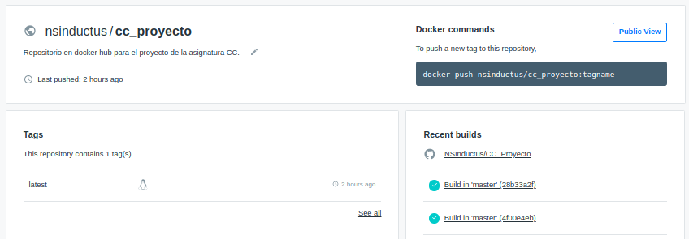
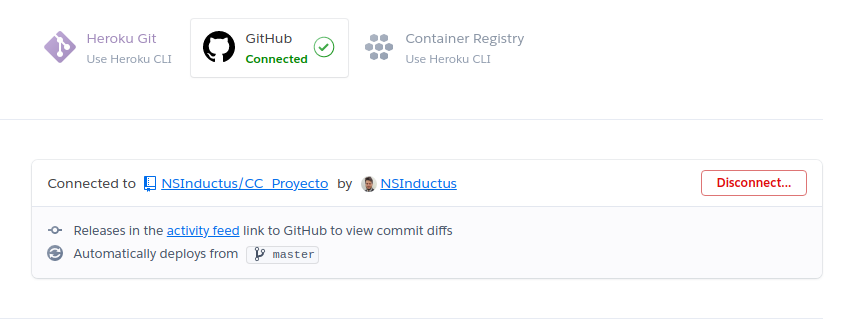

# Proyecto de Cloud Computing

[](https://www.gnu.org/licenses/gpl-3.0)
[](https://travis-ci.com/NSInductus/CC_Proyecto)
[](https://circleci.com/gh/NSInductus/CC_Proyecto)
[](https://codecov.io/gh/NSInductus/CC_Proyecto)
[](https://cc-proyecto.herokuapp.com/)

Proyecto para desarrollar en la asignatura de **Cloud Computing** correspondiente al Máster de Ingeniería Informática.

## Descripción

El proyecto consistirá en un bakc-end para la compra/venta de portátiles. Para una Descripción más detallada del proyecto, ver [aquí](docs/descripcion.md).

## Más información sobre el proyecto

A continuación se muestra en forma de índice el acceso a más información referente al proyecto.

* [Tecnologías utilizadas](docs/tecnologias.md).
* [Historias de usuario](docs/historias_de_usuario.md).
* [Test](docs/test.md).
* [APIs REST](docs/apis_rest.md).
* [Licencia](docs/licencia.md).


## Arquitectura

La arquitectura será una arquitectura basada en microservicios. Para más información acerca de la arquitectura del proyecto, ver [aquí](docs/arquitectura.md).

### Arquitectura de los Microservicios

Los microservicios implementados o que se implementarán tendrán una arquitectura por capas, la cuál se basa en separar la funcionalidad del microservicio en diferentes capas, con el fin de seguir los principios de: *abstracción, encapsulamiento, funcionalidad, alta cohesión, reutilizable y desacople.*

Para información más concreta acerca de la arquitectura de cada microservicio, ver [aquí](docs/arquitectura_miicroservicios.md).


## Herramienta de construcción

Como herramienta de construcción se utilizará **invoke**, por su madurez y fiabilidad frente a otras herramientas , así como por su detallada y clara documentación que permiten al usuario saber como tiene que utilizar invoke en cada momento.

Para poder utilizarla hay que instalarla en python, para eso se escribe en la terminal el siguiente comando:

```shell
$ pip install invoke
```

Para la configuración de la misma, se ha agregado el fichero [tasks.py](https://github.com/NSInductus/CC_Proyecto/blob/master/tasks.py).


```
buildtool: tasks.py
```

Para utilizar la herramienta de construcción se ha de escribir en la terminal "invoke" seguido de la tarea que se desea que realice la herramienta. Estas tareas se han definido anteriormente en el fichero de configuración de la herramienta.

Las posibles tareas que se pueden hacer son:

* **install**: Esta tarea es la encargada de instalar las dependencias necesarias para que funcione nuestro proyecto, las cuales están definidas en el fichero [requirements.txt](https://github.com/NSInductus/CC_Proyecto/blob/master/requirements.txt). Para esto hay que escribir en la terminal:
```
$ invoke install
```

* **test**: Esta tarea es la encargada de ejecutar los test unitarios, sobre nuestras clases de python. Para esto hay que escribir en la terminal:
```
$ invoke test
```

* **coverage**: Esta tarea es la encargada de ejecutar los test de cobertura, sobre nuestras clases de python. Para esto hay que escribir en la terminal:
```
$ invoke coverage
```

* **start**: Esta tarea es la encargada de levantar el microservicios utilizando gunicorn. En esta tarea se pueden utilizar varios argumentos opcionales para modificar el host y los diferentes puertos donde se ejecutarán los microservicios, por defecto el host será *0.0.0.0* , el puerto será *8080* y el puerto_2 será *8000*.
Hay varias opciones:
* No introducir el argumento micro, por lo que lanzará los dos microservicios, Portatiles en el puerto y Transacciones en el puerto_2
* Introducir *Portatiles* en el argumento micro, y solo se lanzará el microservicio Portatiles.
* Introducir *Transacciones* en el argumento micro, y solo se lanzará el microservicio Transacciones.

```
$ invoke start [-h/--host <host>] [-m/--micro <puerto>] [--puerto <puerto>] [--puerto_2 <puerto_2>]
```

* **stop**: Esta tarea es la encargada de detener el microservicio lanzado anteriormente con la tarea: *start*.
```
$ invoke stop
```

## Integración continua

Como herramientas para la integración continua se ha utilizado: **TravisCi** & **CircleCI**. Para más información acerca de la integración continua, ver [aquí](docs/integración_continua.md).


## Docker

En primer lugar decir que se ha utilizado DockerHub para la creación de la imagen de mi proyecto utilizando un archivo Dockerfile.

Contenedor: https://hub.docker.com/repository/docker/nsinductus/cc_proyecto

La imagen residente en el contenedor anteriormente linkado se ha construido sobre una imagen base de debian concretamente debian:unstable-slim. Se ha seleccionado esta imagen como base, después de un proceso de selección el cuál se puede ver [aquí](docs/comparacion_imagenes.md).

### Dockerfile

Como se ha mencionado anteriormente la imagen se ha construido utilizando el archivo archivo [Dockerfile](Dockerfile).

Este archivo cuenta con varias partes:


```
FROM debian:unstable-slim

LABEL maintainer="Angel Murcia Diaz <angelmd96@correo.ugr.es>"
```

En esas primeras dos líneas,se establece la imagen que se va a utilizar como base y se declara quien es la persona que mantiene el contenedor.


```
ARG PORT=8080

ENV PORT=${PORT}
```

En las siguientes 2 líneas, se le da un valor por defecto al puerto, en este caso *8080* y se establece el puerto como variable de entorno para el contenedor.

```
WORKDIR /

RUN apt-get update && apt-get install -y python python3-pip

```

En las siguientes líneas se establece el directorio de trabajo y se actualizan los repositorios y se instala tanto python3 como la herramienta pip.

```
COPY requirements.txt /tmp/

RUN pip3 install --no-cache-dir -r ./tmp/requirements.txt

```

A continuación, se copia el archivo de los requerimientos en la carpeta tmp y se instalan esos requerimientos con la herramienta pip.


```
COPY src /src/

EXPOSE ${PORT}

```

Después se copia los archivos necesarios a la carpeta src y se muestra el puerto donde escucha el servidor.


```
WORKDIR /src/

CMD gunicorn -b 0.0.0.0:${PORT} Portatiles_rest:app

```

Finalmente se establece el directorio de trabajo en la carpeta src y se lanza el servidor utilizando gurnicorn.


### Proceso seguido para la creación de la imagen

En primer lugar me he dado de alta en DockerHub y he linkado mi cuenta de GitHub con mi nueva cuenta de DockerHub. También he instalado la herramienta docker por terminal.

En segundo lugar he creado un repositorio en DockerHub y he linkado mi repositorio con el de Github, como se ve en la siguiente imagen:




Después he probado en local ha construir mi microservicio sobre varias imágenes base, para eso he ido modificando el [Dockerfile](Dockerfile) y utilizando el siguiente comando para crear cada una de las imagenes:

```
& docker build -t nombre_imagen ruta
```

Para posteriormente arrancar el contenedor en local utilizando cada una de las imagenes, con el comando:

```
& docker run ID_nombre_imagen
```
Y después he seguido el proceso explicado en la sección: [Comparación de imágenes base](docs/comparacion_imagenes.md).

Posteriormente se creado el archivo [Dockerfile](Dockerfile) definitivo, rellenado como se ha explicado en la sección anterior  y he realizado un *push* a la rama master de mi proyecto de GitHub.


Después de realizar el *push*, DockerHub automaticamente localiza el Dockerfile en mi repositorio de GitHub y lo utiliza para crear la imagen, la cual se quedará disponible en la web por si alguien la quiere descargar y utilizar, para realizar este proceso simplemente tendría que utilizar los siguientes 2 comandos:


```
$ docker pull nsinductus/cc_proyecto:latest

```

Este primer comando para descargar la imagen de mi microservicio a local.


```
$ docker run ID_de_la_imagen_descargada

```

Este segundo comando para arrancar el contenedor en local.

## Despliegue en Heroku

Como *PaaS* se ha utilizado *heroku*, las razones son:

* Hay mucha documentación sobre esta herramienta.
* Es una herramienta gratuita.
* Permite el uso de contenedores.

La imagen del microservicio de gestión de portátiles esta desplegada [aquí](https://cc-proyecto.herokuapp.com/).


Para desplegar nuestro microservicio se han seguido los siguientes pasos:

En primer lugar se ha creado el archivo [heroku.yml](heroku.yml), en el cual se indica que para construir la aplicación tiene que utilizar el *Dockerfile*.

Posteriormente se ha descargado la herramienta heroku por terminal. Y nos hemos dado de alta en Heroku, así como hemos linkado nuestra cuenta de GitHub con nuestra nueva cuenta de Heroku.

Después se ha abierto una terminal en el directorio del proyecto y se ha realizado el siguiente comando:

```
$ heroku create nombre_app

```

De esta forma crearemos en Heroku un repositorio con el nombre que deseemos.

*Destacar que antes de poder realizar este comando deberemos loguearnos en nuestra cuenta de Heroku*


Después tenemos que escribir el siguiente comando en terminal:


```
$ heroku stack:set container

```

Este comando hace que la imagen del sistema operativo que utilizará hereku cambie a la de nuestro contenedor, es decir la de nuestro Docker.

Finalmente se realiza un *push heroku* para que se suban los cambios a Heroku, el comando utilizado es el siguiente:


```
$ git push heroku master

```


No nos debemos de olvidar de linkar nuestro repositorio de Heroku con nuestro repositorio de GitHub, eso lo podemos hacer desde la página web, como muestra la siguiente imagen:



