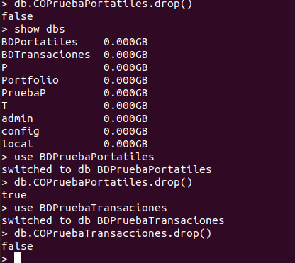
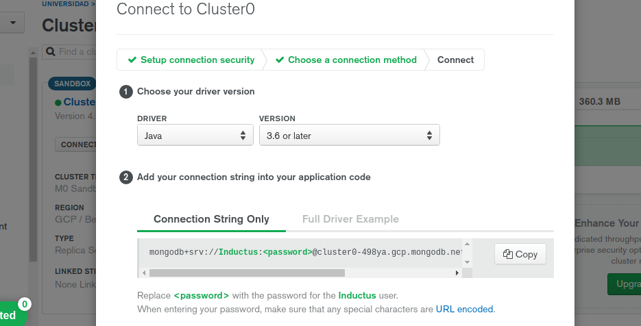

# Almacén de datos

Confirmando lo expuesto en la sección de tecnologías, se ha utilizado **MongoDB** como base de datos para nuestro proyecto, las
razones son las siguientes:

* Realiza muchas operaciones por segundo, siendo mucho más rápida que una base de datos relacional.
* Capaz de almacenar grandes cantidades de datos sin inconveniente.
* Es variable en el sentido de que no fuerza que todos los registros de una colección se guarden con los mismos atributos.

También apuntar que las manipulaciones sobre la base de datos se realizarán concretamente con la librería *pymongo*, que cuenta con una serie de funciones que realizan las operaciones básicas (aunque también más avanzadas) que cualquier tipo de base de datos tiene como búsqueda, inserción, eliminación o actualización de elementos.

Se ha utilizado MongoDB de dos formas diferentes:

* De forma **local**

* De forma **Remoto**

*Destacar que hay una base de datos por microservicio.*

## De forma local

Para poder utilizar MongoDB en local, es decir, desde tu máquina, es necesario instalar mongo, en nuestro caso, se ha instalado la versión *3.6.8*. Para eso se ha introducido en terminal el siguiente comando:

```

sudo apt-get install mongo==3.6.8

```


De este modo ya se pueden utilizar bases de datos de mongoDB de forma local, si introducimos el siguiente comando en terminal:

```

mongo

```

Se puede ver en la siguiente captura de pantalla:



Se acede a la administración de la base de datos a través de la misma terminal donde podremos ver las bases de datos disponibles, sus colecciones internas (lo que en una base de datos SQL serían tablas), insertar, modificar o eliminar datos, entre otras funcionalidades.

## En remoto

Para utilizar MongoBD de forma remota, se valoraron varias opciones, para finalmente acabar quedándonos con **MongoAtlas**, por los siguientes motivos:

* Tiene opciones gratuitas.
* Cuenta con automatización, de tal forma que el usuario puede programar actividades sobre la base de datos MongoDB en la nube.
* Tiene un buen rendimiento.

Una vez seleccionada esta tecnología, nos dirigimos al dominio web de MongoAtlas, el cual es el siguiente: [dominio](https://www.mongodb.com/cloud/atlas).

El primer paso a realizar en esta web es registrarnos (se puede realizar de forma muy rápida usando la cuenta de *gmail*). Seguidamente tendremos que seleccionar un plan, se escogerá el plan gratuito:


Posteriormente debemos de crear un cluster, para ello seleccionamos como base uno de los gratuitos proporcionados por el dominio web. En la siguiente captura de pantalla se puede ver que se ha seleccionado *Cloud* y la región *belga* que son totalmente gratuitas:


Posteriormente el usuario selecciona la opción de *Crear base de datos*, para allí crear la base de datos tan solo introduciendo el nombre de la misma, así como el nombre de la colección (es lo que sería una tabla en una base de datos SQL), se puede ver en la siguiente imagen:


Por ultimo se ha conseguido ver como se conecta la base de datos con cualquier aplicación para utilizarla, es a través de una ruta proporcionada que sustituirá a nuestro *URI*, es decir, a nuestra ruta base. En la siguiente captura de pantalla se puede observar:



*Destacar que en nuestro proyecto para cambiar entre usar MongoDB en local o en remoto es suficiente con modificar las variables de entorno, para más información acerca de estas, clicar [aqui](variables_de_entorno.md)*.

