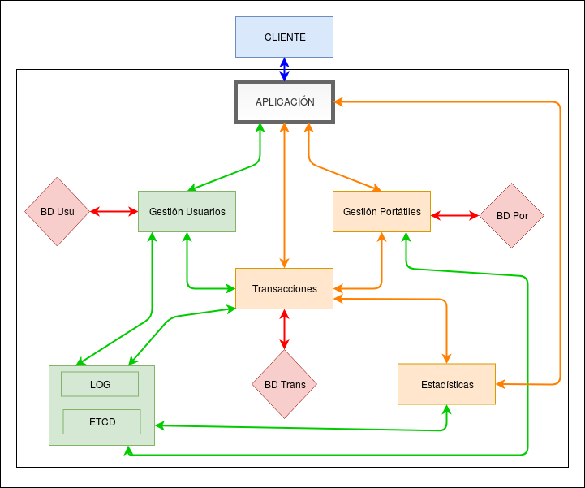

# Arquitectura

La arquitectura será una arquitectura basada en microservicios, contaremos con microservicios que se conectarán entre sí para cumplir con las funcionalidades que ofrece la aplicación. Para resumir la arquitectura de nuestro proyecto se ha realizado el siguiente diagrama, donde se puede ver como están conectados los diferentes servicios, microservicios y bases de datos:

## Servicios

Nuestro sistema tendrá los siguientes servicios: servicio de gestión de usuarios, servicio LOG y servicio ETCD.

### Servicio de gestión de usuarios

Este servicio servirá para la administración de los usuarios de nuestro servicio, deberá de tener funcionalidad para agregar usuarios, borrar usuarios, actualizar usuarios, modificar usuarios, cargar saldo de usuarios, gastar saldo de usuarios y logear a los usuarios. Esto será algo externo a nuestro problema.

### Servicio LOG

Servicio LOG para conectar todos los microservicios de la aplicación.

### Servicio ETCD

Servicio que se utilizará para especificar las configuraciones de los distintos microservicios.

## Microservicios

Nuestro sistema tendrá los siguientes microservicios: microservicio de gestión de ordenadores portátiles, microservicio de transacciones de compra/venta/devolución y microservicio de estadísticas.

### Microservicio de gestión de ordenadores portátiles

Este microservicio servirá para la administración de los ordenadores portátiles de nuestro servicio, tendrá funcionalidad para agregar un ordenador portátil, eliminar un ordenador portátil y de buscar un ordenador portátil a través de una serie de características.

### Microservicio de transacciones de compra/venta/devolución

Este microservicio se encarga de las transacciones necesarias del servicio, tendrá la funcionalidad de vender ordenador portátil, comprar ordenador portátil y devolver ordenador portátil.

#### Microservicio de estadísticas

Microservicio que se encargara de mostrar y recolectar las estadísticas de las transacciones producidas.

## Bases de datos

Se utilizarán en nuestro sistema las siguientes bases de datos: base de datos de usuario, base de datos de ordenadores portátiles y base de datos de transacciones.

### Base de datos de usuarios

Base de datos utilizada para almacenar los datos de usuario.

### Base de datos de ordenadores portátiles

Base de datos utilizada para guardar los ordenadores portátiles que los usuarios han puesto en venta.

### Base de datos de transacciones

Base de datos para almacenar todas las transacciones producidas en el sistema.
