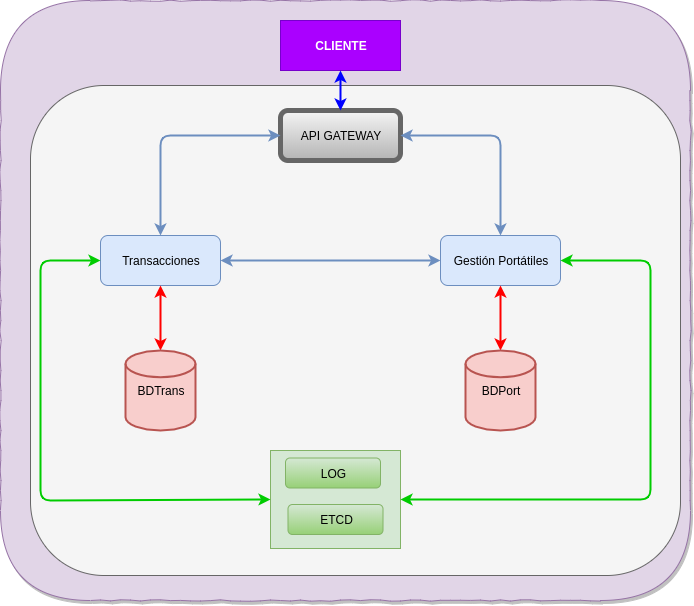

# Arquitectura

La arquitectura será una arquitectura basada en microservicios, contaremos con microservicios que se conectarán entre sí para cumplir con las funcionalidades que ofrece la aplicación. Para resumir la arquitectura de nuestro proyecto se ha realizado el siguiente diagrama, donde se puede ver como están conectados los diferentes servicios, microservicios y bases de datos:

## Servicios

Nuestro sistema tendrá los siguientes servicios: servicio LOG y servicio ETCD.

*Destacar que el servicio de gestión de usuarios es externo a nuestro problema, por lo que no lo menciono en ningún momento al no pertenecer al dominio de nuestro problema.*

### Servicio LOG

Servicio LOG para conectar todos los microservicios de la aplicación.

### Servicio ETCD

Servicio que se utilizará para especificar las configuraciones de los distintos microservicios.

## Microservicios

Nuestro sistema tendrá los siguientes microservicios: microservicio de gestión de ordenadores portátiles, microservicio de transacciones de compra/venta/devolución y microservicio de estadísticas.

### Microservicio de gestión de ordenadores portátiles

Este microservicio servirá para la administración de los ordenadores portátiles de nuestro servicio, tendrá funcionalidad para agregar un ordenador portátil, eliminar un ordenador portátil y de buscar un ordenador portátil a través de una serie de características.

### Microservicio de transacciones de compra/venta/devolución

Este microservicio se encarga de las transacciones necesarias del servicio, en estas transacciones se registrarán compras y devoluciones de ordenadores portátiles. También se encargará de mostrar las estadísticas de las transacciones que realicen los usuarios.

## Bases de datos

Se utilizarán en nuestro sistema las siguientes bases de datos: base de datos de usuario, base de datos de ordenadores portátiles y base de datos de transacciones.

### Base de datos de ordenadores portátiles

Base de datos utilizada para guardar los ordenadores portátiles que los usuarios han puesto en venta.

### Base de datos de transacciones

Base de datos para almacenar todas las transacciones producidas en el sistema.

# Justificaciones de las modificaciones

La arquitectura a sufrido una serie de modificaciones desde el inicio del proyecto hasta el estado que se encuentra.

* Después de reflexionar y pensar se ha llegado a la conclusión de que el microservicio de Estadísticas era innecesario, puesto que lo único que pretendía era traer datos correspondientes al servicio de transacciones y por lo tanto se ha eliminado este microservicio.

* Las historias de usuario correspondientes a este microservicio se han ligado al microservicio de transacciones, puesto que se consideran que pertenecen al mismo. Por lo que ver estadísticas y imprimir estadísticas pasaron a pertenecer al microservicio de Transacciones.
