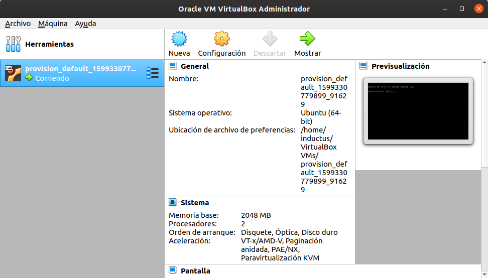
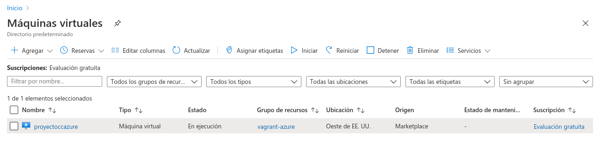
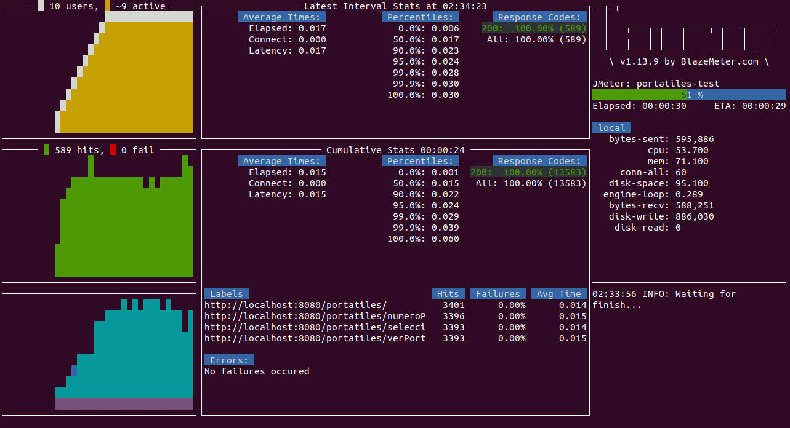
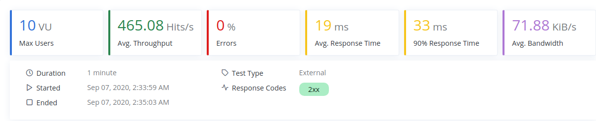
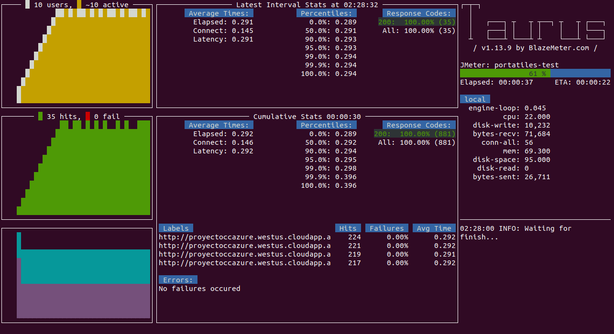
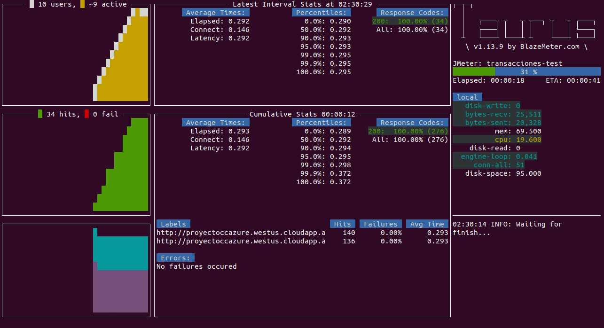

# Despliegue y provisionamiento

Para terminar con el proyecto se ha realizado el despliegue y provisionamiento de los dos mircroservicios: *Portatiles y Transacciones*. 

* Estos microservicios han sido desplegados en máquinas virtuales, tanto de forma local como de forma remota, para ambos casos se utiliza *Vagrant* (herramienta que permite crear entornos de desarrollo reproducibles y compartibles). Se ha seleccionado esta herramienta por los siguientes motivos:
  * Es una herramienta gratuita.
  * Es una herramienta muy fácil de usar, permite crear y configurar máquinas virtuales a partir de simples ficheros de configuración.

* Para el provisionamiento se ha utilizado *Ansible*. Se ha seleccionado esta herramienta por los siguientes motivos:
  * Su instalación es muy sencilla.
  * Tiene gran compatibilidad con elementos de la infraestructura.
  Soporta la mayoría de distribuciones.

* Para crear la máquina virtual de forma remota se ha utilizado el servicio de computación en la nube creado por Microsoft: *Azure*. Los motivos por los que se ha seleccionado *Azure* en lugar de otros como *Google Cloud* son los siguientes:
  * Se puede recurrir a una prueba gratuita de 30 días.
  * Tiene una alta disponibilidad por lo que asegura la continuidad del servicio y disponibilidad de tus datos.
  * Tiene una altas medidas de seguridad.

## Despliegue y provisionamiento: Local

Además de lo comentado anteriormente, destacar que se utilizará *Virtualbox* como herramienta de virtualización, la razón principal es que es una herramienta totalmente gratuita.

En primer lugar, se ha instalado *Virtualbox* a través del siguiente comando:

```
$ sudo apt install virtualbox
```
En segundo lugar, se ha instalado *Vagrant* a través de los siguientes comandos:

```
$ curl -O https://releases.hashicorp.com/vagrant/2.2.6/vagrant_2.2.6_x86_64.deb
$ sudo apt-get update
$ sudo apt install ./vagrant_2.2.6_x86_64.deb

```
En tercer lugar, se ha instalado *Ansible* a través de los siguientes comandos:

```
$ sudo apt-add-repository ppa:ansible/ansible
$ sudo apt-get install ansible

```
También utilizando el plugin de ansible-galaxy, se han instalado roles creados por la comunidad (con los roles podemos crear una estructura de ficheros y directorio para separar los elementos y así poder reutilizarlos fácilmente), para poder utilizarlos directamente en nuestro fichero que describe configuraciones, despliegue y orquestación en *Ansible* comúnmente llamado playbook, en este caso se han descargado los siguientes roles:
  * enix.mongodb
  * geerlingguy.docker

Para instalar estos roles se utilizan los siguientes comandos:

```
$ ansible-galaxy install enix.mongodb
$ ansible-galaxy install geerlingguy.docker
```
Para levantar la máquina virtual utilizando la herramienta *Vagrant* se creará a priori un archivo de configuración llamado *Vagrantfile*, en él se centraliza toda la configuración de la máquina virtual que se desea levantar. El punto fuerte de *Vagrant* es que se puede crear exactamente la misma máquina virtual todas las veces que se desee utilizando el *Vagrantfile*.

El archivo [*Vagrantfile*](https://github.com/NSInductus/CC_Proyecto/blob/master/Vagrantfile) creado para el proyecto se puede ver totalmente documentado [aquí](vagrantfile.md)). En resumen es el archivo que se encarga de configurar la creación de una máquina virtual de 2048 de memoria y 2 cpus que utiliza como imagen base Ubuntu/bionic64 (*justificación de la elección de estas características e imagen base más adelante*), que se provisiona utilizando un playbook de *Ansible*, en mi caso es el fichero [workstate.yml](https://github.com/NSInductus/CC_Proyecto/blob/master/provision/workstate.yml).
		
El fichero [workstate.yml](https://github.com/NSInductus/CC_Proyecto/blob/master/provision/workstate.yml) se puede ver totalmente documentado [aquí](workstate.md)). En resumen configura las tareas necesarias para descargar de DockerHub las imágenes de los dos microservicios de este proyecto y arrancar estos microservicios.

Para el correcto funcionamiento de *Ansible* también es necesario la creación de los siguientes ficheros:
  * [ansible.cfg](): Fichero de configuración general de *Ansible*. 
  * [ansible_hosts](): Fichero que define el inventario utilizado por *Ansible*.

Destacar que como las imágenes descargadas hacían uso de variables de entorno, estas serán inyectadas en [workstate.yml](https://github.com/NSInductus/CC_Proyecto/blob/master/provision/workstate.yml)  de la siguiente forma: vars_files: *ruta_variables*, en *ruta_variables* debemos de introducir la ruta de un archivo con extensión (*yml*) que tenga el siguiente formato:

```yml
URI_BD_P: localhost:27017
BD_P: BDPruebaPortatiles
CO_P: COPruebaPortatiles
URI_BD_T: localhost:27017
BD_T: BDPruebaTransacciones
CO_T: COPruebaTransacciones
HOST: localhost
PORT: "8080"
PORT_2: "8000"
```
Una vez creados todos los ficheros comentados anteriormente pondremos en la terminal el siguiente comando:

```
$ vagrant up --provision
```
Este comando se encargará de crear la máquina virtual utilizando como herramienta de virtualización *Virtualbox* y de provisionarla utilizando *Ansible*.

Para comprobar que los microservicios están correctamente desplegados podemos hacer una petición utilizando exactamente las mismas rutas que anteriormente (*localhost*), puesto que los puertos de la máquina virtual están conectados a los puertos del ordenador.

También es posible acceder a la máquina virtual a través de *SSH*, esto puede ser útil si hay algún tipo de fallo o se desea comprobar los paquetes que estan instalados en la máquina, las imágenes de docker descargas o los contenedores que están arrancados. Para esto se utiliza el siguiente comando:

```
$ vagrant ssh
```
Otra forma de comprobar que la máquina ha sido correctamente creada es abrir la aplicación de escritorio de *Virtualbox* y comprobar como aparece una nueva máquina, como muestra la siguiente captura de pantalla:



Para parar la máquina virtual en marcha se utiliza el siguiente comando:

```
$ vagrant destroy
```
## Despliegue y provisionamiento: Remoto

Para el despliegue y provisionamiento de forma remota y puesto que se ha utilizado *Azure*, el primer paso será instalarlo (azure) de forma local en nuestra máquina, para eso se utilizarán los siguientes comandos:

```
$ sudo apt-get update
$ sudo apt-get install ca-certificates curl apt-transport-https lsb-release gnupg
$ curl -sL https://packages.microsoft.com/keys/microsoft.asc |
    gpg --dearmor |
    sudo tee /etc/apt/trusted.gpg.d/microsoft.gpg > /dev/null
$ AZ_REPO=$(lsb_release -cs)
echo "deb [arch=amd64] https://packages.microsoft.com/repos/azure-cli/ $AZ_REPO main" |
    sudo tee /etc/apt/sources.list.d/azure-cli.list
$ sudo apt-get update
$ sudo apt-get install azure-cli
```

También es necesario instalar:
  * Un plugin de *Vagrant* para que pueda trabajar con *Azure*.
  ```
  $ vagrant plugin install vagrant-azure
  ```
  * Una box que *Vagrant* pueda utilizar.
  ```
  $ vagrant box add azure https://github.com/azure/vagrant-azure/raw/v2.0/dummy.box --provider azure
  ```

Posteriormente se crea una cuenta en: [azure.microsoft.com](https://azure.microsoft.com/es-es/free/search/?&ef_id=EAIaIQobChMIsdzHwtfV6wIV2evtCh3JHgpUEAAYASAAEgJAoPD_BwE:G:s&OCID=AID2100112_SEM_EAIaIQobChMIsdzHwtfV6wIV2evtCh3JHgpUEAAYASAAEgJAoPD_BwE:G:s&dclid=CPOIsMPX1esCFY3OGwodd6YGyg), en mi caso concreto he aprobechado la versión de 30 días de prueba, para conseguirlo tan solo es necesario introducir una serie de datos personales.

Una vez tengamos nuestra cuenta de *Azure*, tenemos que acceder a la misma desde nuestro ordenador, para eso introducimos en la terminal lo siguiente:

```
$ az login
```
Después es necesario registrar la aplicación en *Azure*, de este modo se conseguirán una serie de claves. Para esto se utiliza el siguiente comando:

```
$ az ad sp create-for-rbac
```

Posteriormente necesitaremos la id de suscripción de *Azure*, para esto usamos:

```
$ $ az account list --query "[?isDefault].id" -o tsv
```

Con estos dos últimos comandos conseguiremos la información necesaria para rellenar las variables de entorno del nuevo *Vagrantfile* que se ha creado para el despliegue y provisionamiento de la aplicación de forma remota.

Las variables de entorno necesarias son:
  * AZURE_TENANT_ID = que corresponde al valor que tiene *tenant*.
  * AZURE_CLIENT_ID = que corresponde al valor que tiene *appId*.
  * AZURE_CLIENT_SECRET = que corresponde al valor que tiene *password*.
  * AZURE_SUBSCRIPTION_ID = que corresponde al valor que proporciona el último comando ejecutado.

El nuevo [*Vagrantfile*](https://github.com/NSInductus/CC_Proyecto/blob/master/Vagrantfile) creado para esta parte se detalla [aquí](vagrantfile.md). En resumen, configura la creación de una máquina virtual en tu cuenta de *Azure* con las caracteristicas indicadas (en este caso se ha utilizado un tamaño de "Standard_B2s" (máquina con 2 cores y 4 GiB de memoria)) utilizando una imagen de UbuntuServer:16.04-LTS, así como configura el aprovisionamiento utilizando el mismo playbook que anteriormente ([workstate.yml](https://github.com/NSInductus/CC_Proyecto/blob/master/provision/workstate.yml)).

Finalmente para lanzar el proceso de despliegue y provisión de la máquina virtual remota se ejecuta el siguiente comando:

```bash
$ vagrant up --provider=azure
```
Para comprobar que la máquina virtual ha sido creada en *Azure* correctamente podemos ir a la página web de *Azure*, entrar en nuestra cuenta, entrar posteriormente en "consola" y finalmente en la sección de "máquinas virtuales", de esta forma se puede comprobar si se han creado nuevas máquinas virtuales, como se puede ver en la siguiente captura de pantalla:



*Destacar que estos pasos se han ido siguiendo desde el propio README del proyecto de github del plugin de *Azure* para *Vagrant* (vagrant-azure), el enlace se puede consultar al final en las referencias.*

Para realizar las peticiones se utiliza la siguiente URL.

URL: http://proyectoccazure.westus.cloudapp.azure.com/

A través de esa URL, utilizando los puertos y rutas adecuadas se pueden realizar todas las peticiones que se deseen.

## Tests de Prestaciones para nuestros servivios desplegados

Todos los tests de prestaciones se han realizado con Taurus. Las pruebas se dividen en dos: pruebas iniciales y pruebas sobre microservicios desplegados.

### Pruebas iniciales

Las primeras pruebas se realizaron para seleccionar la imagen base, las candidatas eran: *ubuntu/bionic16, centos/7 y debian/jessie64*

Para comprobar cuál era la que mejores resultados ofrecía se recurrió a realizar *Tests de Prestaciones* con Taurus, para poder hacer una comprobación justa todas las pruebas se han realizado sobre el microservio portátiles y con un despliegue y provisionamiento local.

Los resultados han sido resumidos en la siguiente tabla:

| Imagen base | Avg. Throughput | Avg. Response Time |
|--------|--------|---------|
| ubuntu/bionic64 | 465.08 | 19 |  
| centos/7 | 425.13 | 21 |  
| debian/jessie64 | 459.98 | 19 |  

*Por esto se ha seleccionado Ubuntu para ambos despliegues utilizando la imagen base de "ubuntu/bionic64" como imagen base en el despliegue local y "Canonical:UbuntuServer:16.04-LTS:latest" en el despliegue remoto.*

No se realizaron pruebas para probar diferentes tamaños puesto que mi ordenador no soportaba mucho más de lo que se le asigno a la máquina virtual local, y puesto que se deseaban unas comparaciones justas entre el despliegue local y el despliegue remoto, se intentó buscar unas características similares para la máquina virtual remota, por esto se selecciono de tamaño "Standard_B2s".

### Pruebas sobre microservicios desplegados

Por último, se han realizado *Tests de Prestaciones* a nuestros dos microservicios (*portatiles y transacciones*) sobre los distintos despliegues, es decir, Local y Remoto.

*Destacar que para realizar las pruebas, en el fichero de configuración de las mismas al despliegue remoto se le cambia "localhost" por la URL de nuestro proyecto en Azure. Para esto se han definido dos nuevos escenarios (portatiles-test-azure & transaciones-test-azure) que son iguales que los anteriores escenarios definidos (portatiles-test & transaciones-test), con la unica exepción del cambio comentado anteriormente.*

Podemos esperar que no consigan llegar al número de peticiones al minuto que llegaba antes (cuando se desplegaban los servicios de forma local), es más, ni siquiera podemos esperar que llegue a la mitad y aún menos si pensamos en el despliegue en *Azure". Por lo que 400 peticiones por minuto creo que es el objetivo idoneo a superar en el despliegue en máquinas virtuales locales y 20 en el despliegue en *Azure*.

En primer lugar, se realizarán las pruebas sobre el servicio desplegado en una máquina virtual local.

Para el microservicio de portatiles los resultados son:




Para el microservicio de transacciones los resultados son:


En segundo lugar, se realizarán las pruebas sobre el servicio desplegado en *Azure*o de forma remota.

Para el microservicio de portatiles los resultados son:




Para el microservicio de transacciones los resultados son:




La tabla que resume los resultados mostrados anteriormente es la siguiente:

| Despliegue local/remoto | Microservicio | Avg. Throughput | Avg. Response Time |
|--------|--------|---------|---------|
| Local | portatiles | 465.08 | 19 | 
| Local | transacciones | 419.73 | 21 | 
| Remoto | portatiles | 31.73 | 291 | 
| Remoto | transacciones | 28.08 | 291 | 

Las conclusiones que se puede sacar de estos resultados son las siguientes:
  * Los resultados en términos de velocidad son muy malos, sobretodo si los comparamos con los conseguidos anteriormente cuando lanzabamos los servicios desde nuestro ordenador y se utilizaba una base de datos MongoDB Local, esto es debido a que en estos tests el servicio está siendo desplegado en una máquina virtual utilizando Docker, por lo que la latencia aumenta de manera considerable.
  * Si nos ceñimos a comparar únicamente los resultados de estas 4 pruebas finales se puede decir que el microservicio más rápido según los escenarios que tenemos es el microservicio portatiles.
  * El servicio desplegado en una máquina virtual de forma local es bastante más rápido que el despleguedo de forma remota en *Azure* esto seguramente es debido al retardo lógico al tener el servidor en la nube.
  * Se puede decir que ambos microservicios cumplen con las espectativas (en ambos despliegues) creadas antes de realizar las pruebas.