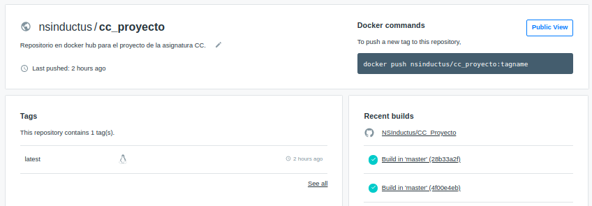
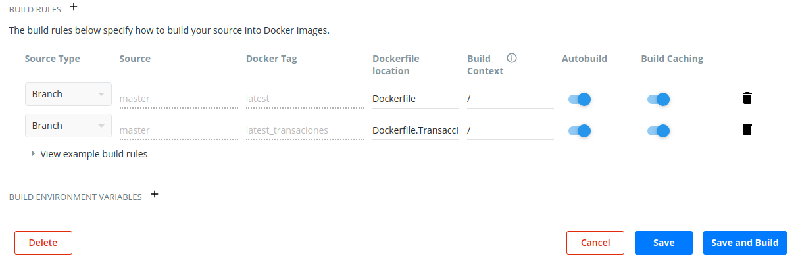

# Docker

Contenedor: https://hub.docker.com/repository/docker/nsinductus/cc_proyecto

La imagen residente en el contenedor anteriormente linkado se ha construido sobre una imagen base de debian concretamente debian:unstable-slim. Se ha seleccionado esta imagen como base, después de un proceso de selección el cuál se puede ver [aquí](comparacion_imagenes.md).

## Dockerfile

Como se ha mencionado anteriormente la imagen se ha construido utilizando el archivo archivo [Dockerfile](https://github.com/NSInductus/CC_Proyecto/blob/master/Dockerfile).

Este archivo cuenta con varias partes:


```
FROM debian:unstable-slim

LABEL maintainer="Angel Murcia Diaz <angelmd96@correo.ugr.es>"
```

En esas primeras dos líneas,se establece la imagen que se va a utilizar como base y se declara quien es la persona que mantiene el contenedor.


```
ARG PORT=8080

ENV PORT=${PORT}
```

En las siguientes 2 líneas, se le da un valor por defecto al puerto, en este caso *8080* y se establece el puerto como variable de entorno para el contenedor.

```
WORKDIR /

RUN apt-get update && apt-get install -y python python3-pip

```

En las siguientes líneas se establece el directorio de trabajo y se actualizan los repositorios y se instala tanto python3 como la herramienta pip.

```
COPY requirements.txt /tmp/

RUN pip3 install --no-cache-dir -r ./tmp/requirements.txt

```

A continuación, se copia el archivo de los requerimientos en la carpeta tmp y se instalan esos requerimientos con la herramienta pip.


```
COPY src /src/

EXPOSE ${PORT}

```

Después se copia los archivos necesarios a la carpeta src y se muestra el puerto donde escucha el servidor.


```
WORKDIR /src/

CMD gunicorn -b 0.0.0.0:${PORT} Portatiles_rest:app

```

Finalmente se establece el directorio de trabajo en la carpeta src y se lanza el servidor utilizando gurnicorn.


## Proceso seguido para la creación de la imagen

En primer lugar me he dado de alta en DockerHub y he linkado mi cuenta de GitHub con mi nueva cuenta de DockerHub. También he instalado la herramienta docker por terminal.

En segundo lugar he creado un repositorio en DockerHub y he linkado mi repositorio con el de Github, como se ve en la siguiente imagen:




Después he probado en local ha construir mi microservicio sobre varias imágenes base, para eso he ido modificando el [Dockerfile](https://github.com/NSInductus/CC_Proyecto/blob/master/Dockerfile) y utilizando el siguiente comando para crear cada una de las imágenes:

```
& docker build -t nombre_imagen ruta
```

Para posteriormente arrancar el contenedor en local utilizando cada una de las imagenes, con el comando:

```
& docker run ID_nombre_imagen
```
Y después he seguido el proceso explicado en la sección: [Comparación de imágenes base](comparacion_imagenes.md).

Posteriormente se creado el archivo [Dockerfile](https://github.com/NSInductus/CC_Proyecto/blob/master/Dockerfile) definitivo, rellenado como se ha explicado en la sección anterior  y he realizado un *push* a la rama master de mi proyecto de GitHub.


Después de realizar el *push*, DockerHub automaticamente localiza el Dockerfile en mi repositorio de GitHub y lo utiliza para crear la imagen, la cual se quedará disponible en la web por si alguien la quiere descargar y utilizar, para realizar este proceso simplemente tendría que utilizar los siguientes 2 comandos:


```
$ docker pull nsinductus/cc_proyecto:latest

```

Este primer comando para descargar la imagen de mi microservicio a local.


```
$ docker run ID_de_la_imagen_descargada

```

Este segundo comando para arrancar el contenedor en local.


## Creación de Dockerfile para microservicio Transacciones_rest

Una vez concluida la implementación del nuevo microservicio, se creó el Dockerfile para este microservicio, el cual es: [Dockerfile.Transacciones](https://github.com/NSInductus/CC_Proyecto/blob/master/Dockerfile.Transacciones).

Se mantuvo la base del anterior, puesto que seguimos manteniendo el criterio que fijo el estudio de la [Comparación de imágenes base](comparacion_imagenes.md).

Cambiando las últimas líneas correspondientes a *gurnicorn*.

Después se visito la página de [Dockerhub](https://hub.docker.com/), accediendo a nuestra sesión y seleccionando el proyecto. Para por último entrar en las reglas de construcción automática para añadir una nueva regla que construya a través de la imagen el contenedor correspondiente al otro microservicio. La nueva regla se puede ver en la siguiente imagen:



*Apuntar que para conservar los contenedores de los dos microservios, a la nueva regla que se añade no se puede olvidar de cambiar el target y poner algo distinto a lo que tiene puesto la regla principal"
