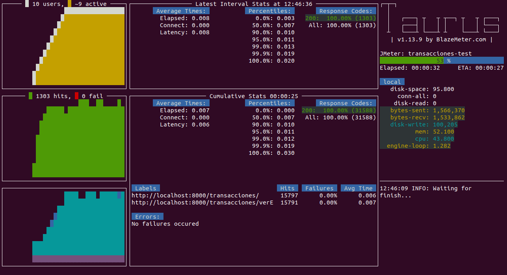
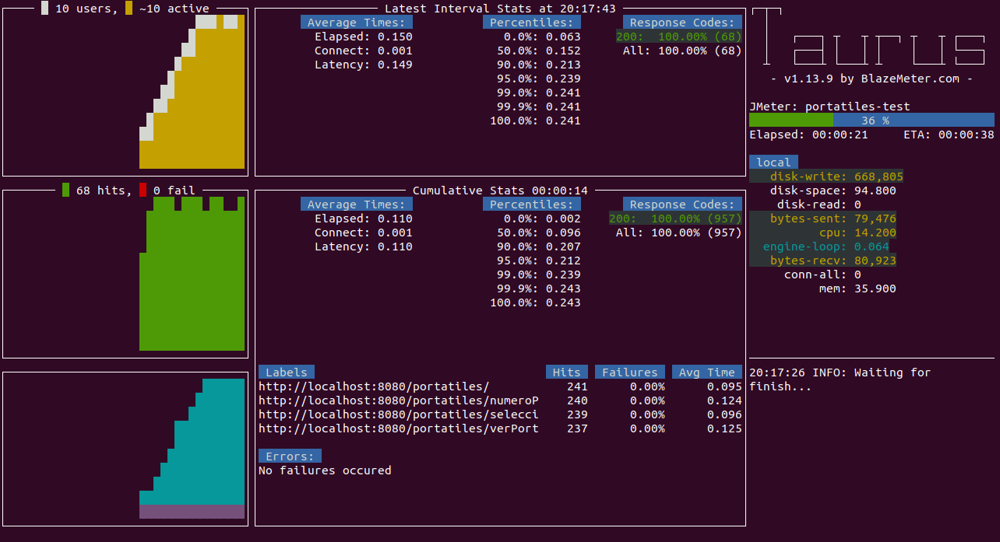
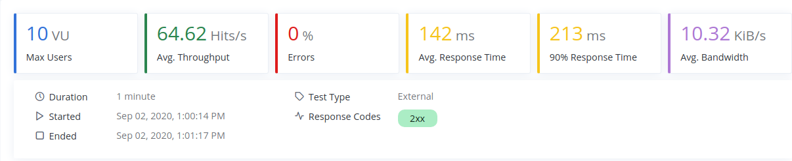
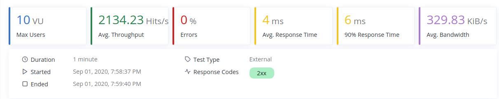
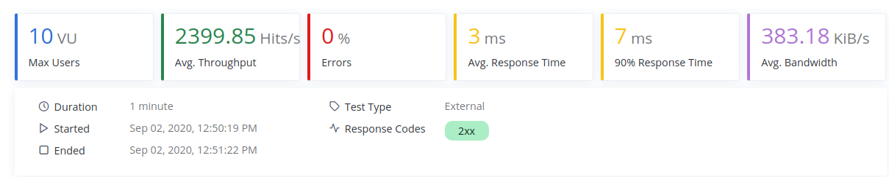
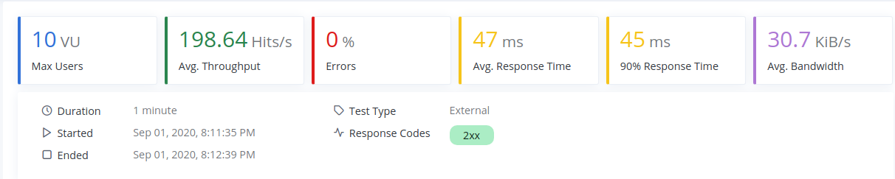
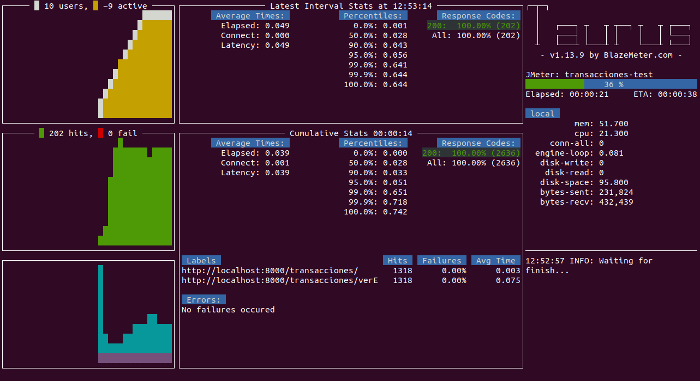
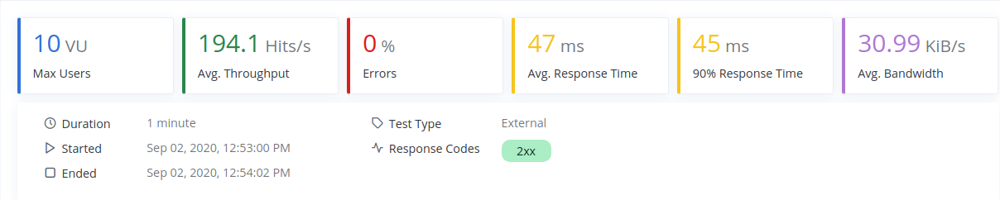
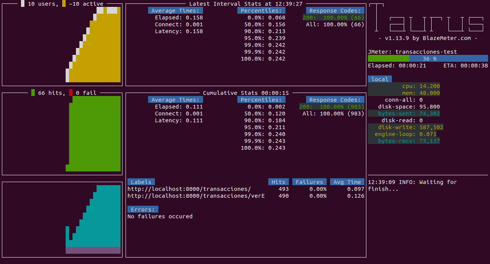

# Estudio de prestaciones

Prestaciones: performance_test.yml

Las prestaciones se han evaluado usando **Taurus**. Se han realizado sobre varios escenarios:

1. Prueba de prestaciones **sobre el microservicio Portatiles**.
2. Prueba de prestaciones **sobre el microservicio Transaciones**.

Estos diferentes escenarios se han probado con dos tipos de bases de datos:

* Una base de datos mongoDB de forma local.
* Una base de datos mongoDB de forma remota, concretamente utilizando MongoAtlas.

Estos diferentes escenarios se han probado levantando el servicio de formas diferentes:

* De forma local, utilizando *gunicorn* con 1 worker.
* De forma local, utilizando *gunicorn* con 2 worker.
* De forma local, utilizando *gunicorn* con 8 worker.
* Levantando un Contenedor(*Docker*).

Mezclando las diferentes posibilidades conseguimos realizar 8 pruebas de prestaciones por microservicio.

Las pruebas de prestaciones debían de superar o igualar *1000 peticiones por segundo* utilizando 10 usuarios concurrentes sin tener ningún error durante el proceso.

El código del fichero donde se definen las pruebas se comentará a continuación:

```
# EVALUACION DE PRESTACIONES CON TAURUS
execution:
    - concurrency: 10   
      ramp-up: 10s      
      hold-for: 50s     
      scenario: portatiles-test  

```
En primer lugar se definen:
* **concurrency:** número de usuarios que participarán de forma simultánea.
* **ramp-up:** tiempo en segundos que tardará en llegar a los usuarios definidos anteriormente .
* **hold-for:** tiempo que se mantienen los usuarios.
* **scenario:** escenario a ejecutar en el test entre los posibles.

```
#Posibles escenarios
scenarios:
    #Escenario microservicio PORTATILES
    portatiles-test:
      requests:
      #Prueba basica: REST DE TRANSACIONES
      - url: http://localhost:8080/portatiles/
        method: GET
      #Numero de portatiles en la BD
      - url: http://localhost:8080/portatiles/numeroPortatilesEnBD
        method: GET
      #Seleccionar un portatil en concreto
      - url: http://localhost:8080/portatiles/seleccionarPortatil/5e2cfeefd46dbb220a0d96
        method: GET
      #Ver portatiles que vende un usuario
      - url: http://localhost:8080/portatiles/verPortatilesEnVentaDeUsuario/358D
        method: GET
```

**El primer escenario: (portatiles-test)**, tiene las siguientes peticiones:

* Una petición *GET* que simplemente es la petición de bienvenida de este microservicio.
* Una petición *GET* para comprobar el numero de portatiles que existen en la base de datos.
* Una petición *GET* que selecciona un determinado portatil de la base de datos con un identificador en concreto.
* Una petición *GET* para encontrar los diferentes portátiles que tiene en venta un usuario, buscando por el DNI del usuario.

```
    #Escenario microservicio TRANSACCIONES
    transacciones-test:
        requests:
        #Prueba basica: REST DE TRANSACIONES
        - url: http://localhost:8000/transacciones/
          method: GET
        #Algun portatil en la base de datos con ese usuario introducido
        - url: http://localhost:8000/transacciones/verEstadisticas/339X
          method: GET
          
```
**El segundo escenario: transacciones-test**, tiene las siguientes peticiones:

* Una petición *GET* que simplemente es la petición de bienvenida de este microservicio
* Una petición *GET* que recoge todas las estadisticas de un usuario, es decir, todas sus transacciones, para ello las cogerá todas y se quedará con las del usuario.

Una vez creado este fichero para ejecutarlo hay que poner en terminal el siguiente comando:

```
$ bzt performance_test.yml -report
```

## Resultados de prestaciones

Para comenzar se levantó el servicio en local utilizando *gunicorn* con 1 solo worker, los resultados se pueden ver a continuación:

* Primer escenario, utilizando 1 Worker y MongoDB de forma local:


En esta prueba se consiguen **1387.9 peticiones por segundo**, teniendo un tiempo de respuesta medio de 6ms.

* Segundo escenario, utilizando 1 Worker y MongoDB de forma local:




En esta prueba se consiguen **1570.8 peticiones por segundo**, teniendo un tiempo de respuesta medio de 8ms.

* Primer escenario, utilizando 1 Worker y una BD remota (MongoAtlas):




En esta prueba se consiguen **66.24 peticiones por segundo**, teniendo un tiempo de respuesta medio de 141ms. Por lo que en estas condiciones no se supera el mínimo de peticiones (1000).

* Segundo escenario, utilizando 1 Worker y una BD remota (MongoAtlas):




En esta prueba se consiguen **64.62 peticiones por segundo**, teniendo un tiempo de respuesta medio de 142ms. Por lo que en estas condiciones no se supera el mínimo de peticiones (1000).

A continuación se subió el número de workers a 2, los resultados se pueden ver a continuación:

* Primer escenario, utilizando 2 Worker y MongoDB de forma local:




En esta prueba se consiguen **2134.23 peticiones por segundo**, teniendo un tiempo de respuesta medio de 4ms.

* Segundo escenario, utilizando 2 Worker y MongoDB de forma local:


En esta prueba se consiguen **1661.38 peticiones por segundo**, teniendo un tiempo de respuesta medio de 5ms.

* Primer escenario, utilizando 2 Worker y una BD remota (MongoAtlas):


En esta prueba se consiguen **130.07 peticiones por segundo**, teniendo un tiempo de respuesta medio de 70ms.

* Segundo escenario, utilizando 2 Worker y una BD remota (MongoAtlas):


En esta prueba se consiguen **131.42 peticiones por segundo**, teniendo un tiempo de respuesta medio de 71ms. Por lo que en estas condiciones no se supera el mínimo de peticiones (1000).

A continuación se subió el número de workers a 8 (cercano al número máximo de workers que puede soportar mi ordenador), los resultados se pueden ver a continuación:

* Primer escenario, utilizando 8 Worker y MongoDB de forma local:


En esta prueba se consiguen **2763.8 peticiones por segundo**, teniendo un tiempo de respuesta medio de 3ms.

* Segundo escenario, utilizando 8 Worker y MongoDB de forma local:




En esta prueba se consiguen **2399.85 peticiones por segundo**, teniendo un tiempo de respuesta medio de 3ms.

* Primer escenario, utilizando 8 Worker y una BD remota (MongoAtlas):




En esta prueba se consiguen **198.64 peticiones por segundo**, teniendo un tiempo de respuesta medio de 47ms. Por lo que en estas condiciones no se supera el mínimo de peticiones (1000).

* Segundo escenario, utilizando 8 Worker y una BD remota (MongoAtlas):




En esta prueba se consiguen **194.1 peticiones por segundo**, teniendo un tiempo de respuesta medio de 47ms. Por lo que en estas condiciones no se supera el mínimo de peticiones (1000).

Por último se realizaron las pruebas utilizando un Docker local para levantar el microservicio, los resultados se pueden ver a continuación:

* Primer escenario, utilizando un Docker y MongoDB de forma local:


En esta prueba se consiguen **1057.7 peticiones por segundo**, teniendo un tiempo de respuesta medio de 8ms. 

* Segundo escenario, utilizando un Docker y MongoDB de forma local:


En esta prueba se consiguen **1309.88 peticiones por segundo**, teniendo un tiempo de respuesta medio de 6ms.

* Primer escenario, utilizando un Docker y una BD remota (MongoAtlas):


En esta prueba se consiguen **65.17 peticiones por segundo**, teniendo un tiempo de respuesta medio de 141ms. Por lo que en estas condiciones no se supera el mínimo de peticiones (1000).

* Segundo escenario, utilizando un Docker y una BD remota (MongoAtlas):




En esta prueba se consiguen **64.77 peticiones por segundo**, teniendo un tiempo de respuesta medio de 142ms. Por lo que en estas condiciones no se supera el mínimo de peticiones (1000).

### Resumen de resultados

El resumen de todas de las pruebas realizadas sobre ambos escenarios se muestran a continuación:

| Servicio | BD | Escenario | Avg. Throughput | Avg. Response Time |
|--------|--------|---------|---------|---------|
| Gunicorn 1 Worker | BD Local | 1 | 1059.7 | 6 |
| Gunicorn 1 Worker | BD Local | 2 | 1570.8 | 8 |
| Gunicorn 1 Worker | BD Remota | 1 | 65.17 | 141 |
| Gunicorn 1 Worker | BD Remota | 2 | 64.62| 142 |
| Gunicorn 2 Workers | BD Local | 1 | 1307.9 | 4 |
| Gunicorn 2 Workers | BD Local | 2 | 1661.38 | 5 |
| Gunicorn 2 Workers | BD Remota | 1 | 66.24 | 70 |
| Gunicorn 2 Workers | BD Remota | 2 | 131.42 | 71 |
| Gunicorn 8 Workers | BD Local | 1 | 2139.23 | 3 |
| Gunicorn 8 Workers | BD Local | 2 | 2399.85 | 3 |
| Gunicorn 8 Workers | BD Remota | 1 | 130.07 | 47 |
| Gunicorn 8 Workers | BD Remota | 2 | 194.1 | 47 |
| Docker | BD Local | 1 | 2763.8 | 8 |
| Docker | BD Local | 2 | 1309.88 | 6 |
| Docker | BD Remota | 1 | 198.64 | 141 |
| Docker | BD Remota | 2 | 64.77 | 142 |

### Conclusiones de los resultados

Las conclusiones obtenidas de la ejecución de estas pruebas son:

* **Ambos microservicios (Portatiles & Transacciones)** han superado todas las prueba utilizando una base de datos local, puesto que se ha conseguido que superen las 1000 peticiones por segundo, en algunos casos las han multiplicado. En las pruebas que se utiliza una base de datos remota se nota mucho la diferencia en las peticiones, debido a la latencia que se produce al conectar con la base de datos remota.
* Como más peticiones se consiguen es levantando el servicio con 8 Workers utilizando guricorn o levantando un Docker local.
* Conforme más Workers utiliza guricorn mejores resultados se consiguen.

También documento, que se comenzó ejecutando las pruebas sobre una máquina virtual instalada en mi ordenador portátil, los resultados de lanzar la prueba del primer escenario (1 Worker con MongoDB local) en la máquina virtual, fueron los siguientes:


Por lo tanto se decidió cambiar la máquina virtual por mi ordenador de sobremesa que tiene instalado Ubuntu 19, y los resultados comenzaron a ser satisfactorios (resultados expuestos anteriormente).

Por lo que se concluye que la máquina donde se realiza el test de prestaciones también es importante y realizarlas en una máquina virtual no es una buena idea.