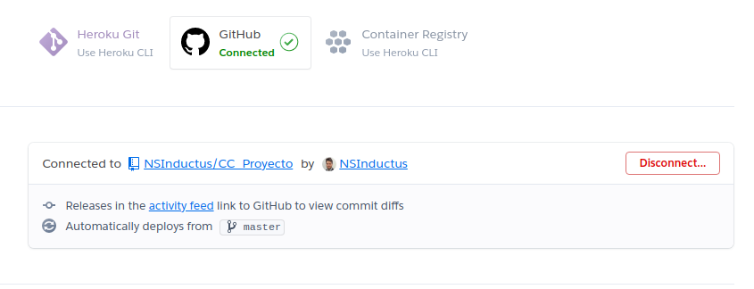

# Despliegue en Heroku

Como *PaaS* se ha utilizado *heroku*, las razones son:

* Hay mucha documentación sobre esta herramienta.
* Es una herramienta gratuita.
* Permite el uso de contenedores.

La imagen del microservicio de gestión de portátiles esta desplegada [aquí](https://cc-proyecto.herokuapp.com/).


Para desplegar nuestro microservicio se han seguido los siguientes pasos:

En primer lugar se ha creado el archivo [heroku.yml](heroku.yml), en el cual se indica que para construir la aplicación tiene que utilizar el *Dockerfile*.

Posteriormente se ha descargado la herramienta heroku por terminal. Y nos hemos dado de alta en Heroku, así como hemos linkado nuestra cuenta de GitHub con nuestra nueva cuenta de Heroku.

Después se ha abierto una terminal en el directorio del proyecto y se ha realizado el siguiente comando:

```
$ heroku create nombre_app

```

De esta forma crearemos en Heroku un repositorio con el nombre que deseemos.

*Destacar que antes de poder realizar este comando deberemos loguearnos en nuestra cuenta de Heroku*


Después tenemos que escribir el siguiente comando en terminal:


```
$ heroku stack:set container

```

Este comando hace que la imagen del sistema operativo que utilizará hereku cambie a la de nuestro contenedor, es decir la de nuestro Docker.

Finalmente se realiza un *push heroku* para que se suban los cambios a Heroku, el comando utilizado es el siguiente:


```
$ git push heroku master

```


No nos debemos de olvidar de linkar nuestro repositorio de Heroku con nuestro repositorio de GitHub, eso lo podemos hacer desde la página web, como muestra la siguiente imagen:



